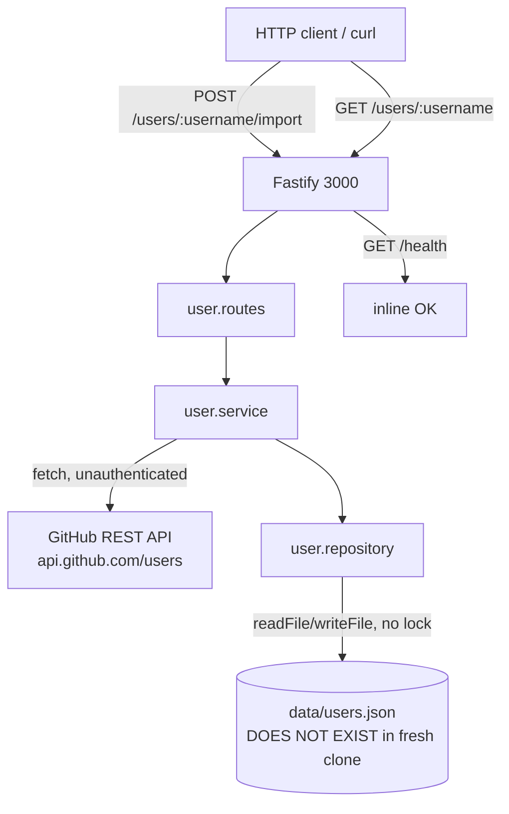
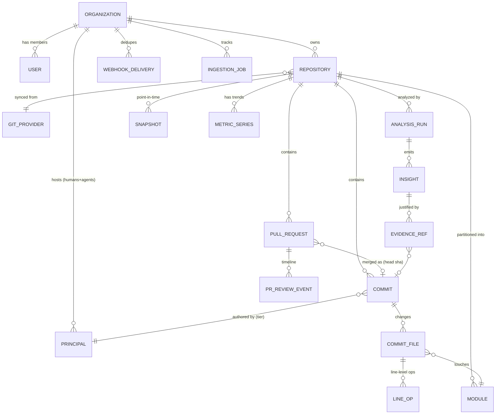
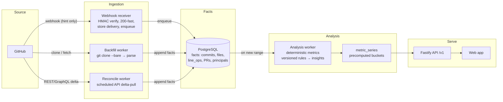

# GitLens — Master Product, Architecture & 6-Month Roadmap

**Version:** 1.0
**Date:** 2026-10-01
**Prepared from:** full inspection of `Arash-abraham/GitLens` @ `eab57b2` (2026-10-01) + external research (cited in [Sources](#sources))
**Status:** Planning document. **Nothing in this plan has been implemented yet** — per the brief, coding starts only after review.

---

## How to Read This Document

Every claim is tagged so facts are never mistaken for guesses:

| Tag | Meaning |
| --- | --- |
| **[FACT]** | Directly observed in the repository, or verifiable from a cited external source. |
| **[INFERENCE]** | A conclusion that reasonably follows from observed facts. |
| **[ASSUMPTION]** | Unproven; adopted for planning purposes. Must be validated (see Part XXXIII). |
| **[PROPOSAL]** | A recommendation made in this document. |
| **[OPEN QUESTION]** | Must be resolved before a final decision (see [Open Questions](#open-questions)). |

Two standing principles, applied everywhere:

1. **Build the simplest architecture that can support the validated product.** No Kubernetes, Kafka, ClickHouse, Elasticsearch, microservices, or event sourcing for the MVP — none are justified by any current or 6-month requirement.
2. **Deterministic core, AI on top.** Every number shown to a user must be reproducible from the same input data. AI may *explain* and *summarize*; it never *measures*.

---

# Executive Summary

## 1. What GitLens is today [FACT]

The repository is a **day-zero skeleton**, not a working product:

- **12 files, 1 commit** (`eab57b2`, 2026-09-27, single author), ~184 lines of TypeScript.
- A Fastify 5 HTTP server (`src/index.ts`) on port 3000 with **one feature**: `POST /users/:username/import` fetches a GitHub *user profile* via the unauthenticated public REST API and `GET /users/:username` reads it back.
- Storage is a **JSON file on disk** (`data/users.json`). The `data/` directory does not exist in a fresh clone, so **the import endpoint fails with 500/ENOENT out of the box** (reproduced during this audit).
- `npm run build` **fails with 15 TypeScript errors** (`verbatimModuleSyntax` + `module: nodenext` conflict: `package.json` lacks `"type": "module"`), and even when emitted, output lands next to sources in `src/` (no `outDir`), so `npm start` (`node dist/index.js`) can never work as configured.
- `package-lock.json` has `resolved` URLs pointing at a **private registry mirror** (`package-mirror.liara.ir`), which is unreachable outside that network — `npm ci` fails for anyone else (reproduced).
- **No** tests (vitest installed, zero test files), **no** CI/CD, **no** auth, **no** rate limiting, **no** input validation (zod is a dependency but imported nowhere), **no** env handling, **no** frontend, **no** database, **no** documentation beyond a one-line README, **no** git-domain entities whatsoever (no commits, repositories, or PRs modeled).

**[INFERENCE]** The existing code is a competent starting *habit* (modular layout: routes → service → repository, typed DTOs, infrastructure separated from modules) that can be preserved, but **zero of it can be reused for the product** — the only feature (GitHub user profiles) is outside the product scope, and the storage/build/tooling must be rebuilt. The honest way to describe the current repo: *a TypeScript + Fastify module skeleton with one toy endpoint and a broken build pipeline.*

## 2. What problem GitLens should solve

The market context in 2026 is decisive and, in places, **contradicts the initial hypothesis in the brief**:

- AI-assisted development is now near-universal: ~90% of developers use AI, ~41% of new code is estimated AI-generated, and code churn (lines rewritten/reverted within two weeks) has roughly **doubled** since AI tools went mainstream (3.1% → 5.7–7.1% across studies). [FACT, cited: [11][12][14][15][16]]
- Google's 2025 DORA report: AI **increases throughput but also correlates with higher delivery instability** (more change failures, rework, verification load — the "verification tax" and "trust paradox"). [FACT, cited: [11][12][13]]
- Teams cannot currently answer, per repository, the questions this creates: *Which changes are holding up and which are being churned out? Who (which human, which agent) made them? Where is risk concentrating? Is our codebase getting more or less stable as AI adoption rises?* [ASSUMPTION — strongly supported by the cited evidence, to be validated in Part XXXIII]
- **However, the category "engineering intelligence from git history" is already crowded and commoditizing**: LinearB, Swarmia, GitClear, CodeScene, DX, Jellyfish, Hatica, Lighthaus, Apache DevLake, and more. And **GitHub itself is shipping native "AI impact" dashboards** (Copilot usage metrics API now reports *repository-level* agent PR activity as of 2026-07-17; Code Quality GA 2026-07-20; Agent HQ mission control). [FACT, cited: [6][7][8][22][23][24][25]]
- **Therefore: a generic "insights from your git history" product is a losing position in 2026.** It is a feature of GitHub and a commodity of the SEI (Software Engineering Intelligence) vendors. [INFERENCE]

**[PROPOSAL — the core recommendation of this document]:**

> **GitLens should be a deterministic, evidence-first Change Intelligence layer for the human + agent era.**
>
> It ingests the full git history of a repository (provider-agnostic, GitHub first), models *every change* (commits, files, lines, authors, including AI agents and bots), and computes reproducible facts about **what changes are doing over time**: survival, churn, rework, co-change, blast radius, review latency, and attribution with stated confidence. On top of those facts it produces *explainable risk signals* (never a black-box score) and — optionally — AI-written explanations of the evidence.
>
> It is **not** a GitHub clone, **not** a git client, **not** a vanity dashboard, **not** an AI code reviewer, **not** a developer ranking system, and **not** a generic DORA dashboard.

One sentence for the buyer:

> "Your AI agents ship 3× more code. GitLens shows you which of that code survives, where the rework is concentrating, and which parts of the codebase are at risk — with the evidence, per file, per change, per author (human or agent)."

## 3. Why this direction

1. **The pain is real and growing, with third-party evidence** (churn doubling, instability correlation, 4.6× longer review waits for AI PRs — [16]). The pain is *post-merge*: tools like Copilot/Cursor/Claude Code measure *during* the session; nothing vendor-neutral measures *what happened after the merge*. [INFERENCE]
2. **Git history is the only ground-truth, cross-vendor, tamper-evident record of what a human or agent actually did.** IDE telemetry is tool-locked and private; PR metadata is partial; the commit graph + diffs is complete. [FACT about the medium][INFERENCE about the strategy]
3. **The deterministic core is buildable by a small team** (parsing git history is hard but finite engineering; no ML platform needed) and is *testable for correctness* — unlike an LLM opinion product. [INFERENCE]
4. **It is structurally different from GitHub's native features**: GitHub's dashboards are usage-centric (counts of agent PRs), vendor-scoped (Copilot), and point-in-time; they do not do line-level survival analysis, cross-vendor agent attribution, co-change/coupling analysis, or historical risk trends. [INFERENCE from [6][7][8]; validate against GA product surface]
5. **It is structurally different from the SEI incumbents**: they are org-level, dashboard-centric, per-seat priced, weak on code-level analysis (several explicitly have "no code-level analysis" — [25]), and none has deep line-level agent-survival analysis as its *core*. GitClear is closest on AI attribution (via vendor API integrations) but is a metrics-suite product, not an evidence drill-down product. [FACT/INFERENCE, cited: [3][4][5][22][23][25]]

## 4. What must NOT be built (condensed; full list in Part III)

GitHub-clone UIs, git clients, decorative KPI dashboards, generic "ask AI about your repo" chat, code generation, generic AI code review, per-developer numeric rankings, and any "Risk Score = 87" black box. Details and rationale: Part III.

## 5. What the final product looks like (≈ 12–18 months out)

- **Self-serve onboarding:** connect a GitHub org (GitHub App, read-only), pick repositories; full-history backfill via direct git clone in minutes, then near-real-time via webhooks + reconciliation.
- **Repository health:** stability/churn trends, hotspots (files/modules by change frequency × rework), reversion and rework rates, knowledge concentration, agent share of changes — every number clickable to raw evidence.
- **Hotspot drill-down:** the change history of a file/module, co-change partners, who/what touches it, explicit reverts, and deterministic risk signals with explanations.
- **PR Change Report (optional bot):** when a PR opens, deterministic signals about the *context* of the change (touches an unstable module, high-rework area, single-maintainer area, X% of diff in agent-attributed commits) — *not* a review of the code itself.
- **AI explanations (opt-in, evidence-anchored):** "Why is this a hotspot?" narratives generated from the stored evidence, cited, cached, regenerable.
- **Agent ledger:** per-repo and per-module attribution of changes to humans/agents/bots (with stated confidence tiers), and survival/rework statistics for agent-attributed vs. human-attributed changes.
- **Open-core:** analysis engine + CLI open source (self-hostable, trust-building); multi-tenant cloud adds sync, collaboration, AI, and cross-org benchmarks.

## 6. Biggest risks (details in Parts XXXI–XXXII)

1. **GitHub ships "good enough" natively** (they have the data and are moving fast). Mitigation: go deeper (line-level, cross-vendor, deterministic, self-hostable), embed in workflow (PR signals), serve GitLab/self-hosted git too.
2. **Willingness-to-pay may be lower than hoped** (SEI tools price at $15–50/dev/mo with a mature market; a new tool must beat "free GitHub Insights"). Mitigation: start with a sharp wedge (agent-era quality anxiety), price per repository, open-core to build trust.
3. **The name "GitLens" collides with GitKraken's 53M-install VS Code extension**, including its own "GitLens Community / Pro" branding. This is a discoverability and trademark problem that the current plan does **not** wave away — see Part XXII and Open Questions. **[I disagree with keeping the name as-is; rebrand evaluation is a top-3 task.]**

## 7. What to do right now (before more planning or code)

1. Decide the name (see Open Question Q1) — it changes packaging, README, domains, and OSS repository.
2. Run 5–8 discovery interviews with tech leads/EMs at AI-adopting teams (Part XXXIII, experiments E1–E4) to validate the wedge before Month 1 code.
3. Start the Month-1 foundation work defined in Part XVII (build pipeline fix, domain model, git-history ingestion spike on 5 real repos).

---

# Part I — Current Repository Audit

## 1. Current State

### 1.1 Inventory [FACT]

```text
GitLens/                          (12 files, 1 commit, single author, branch: main)
├── .gitignore                    node_modules/, dist/, .env, .env.* (allows .env.example), data/
├── Logo/gitLensLogo.png          1.9 MB PNG logo
├── README.md                     "# GitLens" (1 line)
├── package.json                  gitlens v1.0.0, ISC license
│     deps:        fastify ^5.12.5, zod ^4.6.5
│     devDeps:     typescript ^7.0.2, tsx ^4.23.15, vitest ^5.0.2, @types/node ^26.6.3
│     scripts:     dev (tsx watch), build (tsc), start (node dist/index.js), test (vitest)
├── package-lock.json             v3 lockfile; resolved URLs point to package-mirror.liara.ir
├── tsconfig.json                 module: nodenext, target: esnext, strict, verbatimModuleSyntax,
│                                 exactOptionalPropertyTypes, noUncheckedIndexedAccess,
│                                 sourceMap + declaration + declarationMap, jsx: react-jsx,
│                                 no outDir/rootDir, types: []
└── src/
    ├── index.ts                  Fastify bootstrap, port 3000, host 0.0.0.0, registers userRoutes
    ├── infrastructure/
    │   └── github/
    │       └── github.client.ts  fetchGitHubUser(): unauthenticated GET api.github.com/users/:login,
    │                             Accept: application/vnd.github+json, User-Agent: GitLens,
    │                             throws Error on !ok; maps to GitHubUser DTO
    └── modules/users/
        ├── user.types.ts         GitHubUser interface (12 fields incl. PII: bio, company, location)
        ├── user.routes.ts        POST /users/:username/import, GET /users/:username, GET /health
        ├── user.service.ts       importUser = fetch + save; getUser = find
        └── user.repository.ts    saveUser/findUser over data/users.json (read-modify-write, no lock)
```

### 1.2 Per-component assessment

| Component | Responsibility | Dependencies | Problems (verified) | Future relevance |
| --- | --- | --- | --- | --- |
| `src/index.ts` | HTTP bootstrap | fastify | Port hardcoded; no env config; no graceful shutdown; no global error handler | Keep the pattern (Fastify is a fine choice), rewrite config/shutdown |
| `users` module | GitHub user profile import/read | github.client, fs | Broken storage (ENOENT on fresh clone — reproduced); race-prone read-modify-write JSON; no validation of `:username` (zod unused); no rate-limit handling (public API: 60 req/h/IP) | **Delete.** Outside product scope. The module *pattern* (routes/service/repository/types) is the only thing to preserve |
| `infrastructure/github` | GitHub REST client | node fetch | Unauthenticated; no auth header support; no timeout; no retries/backoff; no rate-limit header handling; no error taxonomy | **Replace** with a GitHub App–based client (installation tokens, retries, rate-limit budgeting) — but it will be much larger; the current client is a toy, not a foundation |
| Build pipeline | — | typescript 7.0.2 | `npm run build` fails (15 TS errors, reproduced); emit location wrong (no `outDir` → files land in `src/`); `npm start` unrunnable | **Rebuild** (Part XXXVII TASK-003) |
| Lockfile | — | npm | Private-mirror `resolved` URLs break `npm ci` for everyone outside that network (reproduced: ECONNRESET) | **Regenerate** from public registry |
| Tests | — | vitest | None exist | Full strategy in Part XXVII |
| README/docs | — | — | One line | Rewrite in Month 1 |

### 1.3 Verified defects (reproduced in sandbox, 2026-10-01)

| # | Defect | Evidence |
| --- | --- | --- |
| D1 | `npm run build` fails: 15 × TS1295/TS1287 — ESM syntax in files TS treats as CommonJS (`verbatimModuleSyntax` + `module: nodenext` + missing `"type": "module"`). Despite errors, tsc emitted `.js/.d.ts/.map` **into `src/`** (no `outDir`), and `dist/` was never created, so `npm start` is guaranteed broken. | `npm run build` run in a temp copy of the repo |
| D2 | First `POST /users/:username/import` on a fresh clone → `ENOENT: no such file or directory, open 'data/users.json'` (500 to client). `data/` is gitignored and never created by any script. | `saveUser()` called directly: `SAVE ERROR: ENOENT ...` |
| D3 | `npm ci` fails outside the Liara network: lockfile `resolved` URLs all point to `https://package-mirror.liara.ir/...` (ECONNRESET ×3 per package). | `npm ci` log |
| D4 | No input validation: any string in `:username` (including `..`, `@user`, 200-char strings) is forwarded to GitHub and, on error, the raw upstream status is thrown. | Code inspection `user.routes.ts`, `github.client.ts` |
| D5 | No timeout on `fetch` → a hung GitHub response hangs the request indefinitely. | Code inspection |
| D6 | Concurrent `saveUser` calls = lost updates (read-modify-write on one JSON file, no locking/atomic write). | Code inspection `user.repository.ts` |
| D7 | Unauthenticated GitHub calls share one IP budget: 60 req/h on a public server → the import endpoint exhausts the budget within ~60 imports/hour. | [32][33] + code inspection |
| D8 | `tsconfig` sets `jsx: react-jsx` with no React dependency; `main: index.js` and `start: node dist/index.js` are stale relative to the TS source layout. | Code inspection |

## 2. Architecture Assessment

### 2.1 What exists (source-true diagram)



### 2.2 Assessment [INFERENCE]

| Dimension | Assessment |
| --- | --- |
| Modularity | The *pattern* is good (module folders with routes/service/repository/types; `infrastructure/` separated from `modules/`). This is the one asset to keep. |
| Separation of concerns | Acceptable for the toy: routes → service → repository, client in infrastructure. No leaking of DB/HTTP into routes beyond status codes. |
| Dependency direction | Correct at this scale (routes → service → repository → fs; service → infrastructure client). But the client imports a *type from a module* (`user.types`) into `infrastructure/` — a mild inverted dependency that will hurt once the GitHub client serves many modules. [FACT about the import][INFERENCE about the fix: infrastructure DTOs should be self-contained or mapped at the boundary] |
| Domain boundaries | **None exist yet** — there is no domain, only a GitHub user profile fetch. The product domain (repositories, commits, changes, insights) is 0% present. |
| Infrastructure isolation | Partial: one fs-based "repository" with no interface/abstraction, so it cannot be swapped for Postgres without touching the service. |
| API design | Minimal, no versioning (`/v1`), no pagination, no consistent error envelope, no auth. Fine as a pattern reference; insufficient as an API. |
| Data access | Inadequate for anything beyond one user: JSON file, no schema, no concurrency, no retention. |
| Scalability | None by design (single process, file I/O). Not a defect at day zero — but it rules out reuse for the product. |
| Maintainability | Code style is clean and typed; naming consistent; small enough that a full rewrite of the feature layer is cheaper than a refactor. |
| Testability | The layering is testable in principle; in practice nothing is tested and the storage layer is un-swappable (no interface). |

**Verdict [PROPOSAL]:** keep Fastify + TypeScript + the module-folder convention; **rewrite everything else**. Do not attempt to "evolve" the users module — delete it in Month 1 (after preserving its patterns in a style guide).

## 3. Technical Debt

Severity scale: Critical (blocks the product build) / High (will cause incidents or rework) / Medium / Low.

| Issue | Severity | Impact | Why (evidence) | Recommendation |
| --- | --- | --- | --- | --- |
| T1 Build pipeline broken (15 TS errors; wrong emit dir; `npm start` dead) | **Critical** | No reproducible artifact; no CI possible; onboarding friction | D1 reproduced | TASK-003: add `"type": "module"`, set `rootDir`/`outDir`, `noEmitOnError`, add `npm run typecheck`; validate with CI |
| T2 Lockfile pinned to private mirror | **Critical** | `npm ci` fails for every non-Liara environment (collaborators, CI, reviewers) | D3 reproduced | Regenerate `package-lock.json` against `registry.npmjs.org`; add `engine`/registry checks; add CI install step |
| T3 No tests at all | **Critical** | Analytics engine correctness (the entire product) is unverifiable | 0 test files | Part XXVII strategy; start with ingestion golden-repo tests in M1–M2 |
| T4 Storage feature broken on fresh clone (ENOENT) | High | Only existing feature cannot run without manual `mkdir data` | D2 reproduced | Delete feature (out of scope) — or if kept: create dir + atomic writes |
| T5 JSON-file storage (no DB, no concurrency, PII in plaintext file) | High | Lost updates; no queryability; data leak surface if repo is shared | D6; `user.types.ts` PII fields | Delete; Postgres from M1 for all persistent state |
| T6 Unauthenticated GitHub access, no timeout/retry/rate-limit handling | High | 60 req/h IP budget; hung requests; unbounded retries | D5, D7 | New GitHub App–based client with token mgmt, timeouts, budgeted retries (Part VII) |
| T7 No auth/authz on API, no input validation (zod unused) | High | Any internet client can hit endpoints; malformed input forwarded upstream | D4; `grep` for zod: no import in `src/` | All new routes behind auth (Part XXV) + zod validation at every boundary |
| T8 No CI/CD, no lint/format config, no error envelope, no env/config layer | Medium | Quality drift; no safety net for a green build | Repo inventory | Part XXIX; introduce in M1 alongside T1 |
| T9 `jsx: react-jsx` without React; stale `main`/`start` scripts | Low | Confusion; dead config | D8 | Clean tsconfig/package.json in TASK-003 |
| T10 1.9 MB logo in git; no LICENSE file despite ISC in package.json | Low | Repo hygiene; OSS readiness | Inventory | Compress logo or move to docs; add LICENSE (pick Apache-2.0 or MIT for OSS engine — see Part XXIV) |

## 4. Security Review

Scope: architecture and risk, no exploits. Current state is pre-product; the review doubles as the security baseline the new build must meet.

| Area | Current state [FACT] | Risk if carried forward | Required target state (see Part XXV for full design) |
| --- | --- | --- | --- |
| Authentication | None — all endpoints public | Unbounded external calls (cost + GitHub IP budget), data access to imported profiles | GitHub-based sign-in; per-org installation authorization |
| Authorization | None | Any user can read any other's imported data | Org-scoped resources; Postgres RLS keyed on `org_id` |
| Secrets / token handling | No token exists anywhere (unauthenticated calls) | N/A today | GitHub App (no PAT storage); installation JWT + 1h installation tokens; envelope encryption at rest; no tokens in logs |
| GitHub credentials | Public API only | Rate-limit exhaustion (60/h/IP), ToS exposure for bulk use | GitHub App, read-only permissions: `contents:read`, `pull_requests:read`, `metadata:read` (+ `pull_requests:write` only if the PR-bot is shipped) |
| Webhook security | No webhooks exist | — | HMAC-SHA256 (`X-Hub-Signature-256`) with `crypto.timingSafeEqual`; store `X-GitHub-Delivery` with unique constraint as idempotency key; treat webhooks as *hints only* (GitHub performs no automatic retry of failed deliveries and redelivery is manual for 3 days — [29][30]) |
| API security | Port 0.0.0.0, no rate limiting, no TLS termination story | Abusable endpoint; DDoS on the GitHub budget | Reverse proxy + TLS; app-level per-tenant rate limits; per-installation request budgets |
| Input validation | None (zod installed, unused); `:username` forwarded raw | Garbage/error-message leakage; upstream abuse | Zod schema on every param/body/query; strict param types (login: `^[a-z\d-]{1,39}$` etc.) |
| Injection risks | None observed (no SQL; JSON parse of own file only) | N/A | SQL via parameterized ORM (drizzle/pg); never string-concatenate |
| SSRF | `fetch` to a fixed host (`api.github.com`) with a templated, `encodeURIComponent`-ed path — low but not zero (no scheme/origin pinning) | If the client ever accepts user-supplied URLs → SSRF | Pin allowlist of hosts; never fetch user-supplied URLs |
| Rate limiting | None | Budget exhaustion, noisy neighbor | Per-tenant token bucket; global GitHub budget manager (Part VII) |
| Tenant isolation | Single flat file, no tenant concept | Cross-tenant leak is trivial | `org_id` on every row; RLS; per-tenant keys; no shared mutable caches without tenant key |
| Data leakage | PII (bio/company/location) written to a plaintext, world-readable-by-default JSON; fastify `logger: true` logs request URLs (which include usernames) | PII exposure on disk/logs | Minimize stored PII; field-level minimization (no bio/company/location at all); structured logging with redaction; no diff content in logs |
| Dependency vulnerabilities | 6 runtime deps, no audit process; lockfile pins exact versions (good) | Supply-chain + unpatched CVEs | `npm audit` + Dependabot in CI; minimal dep set; no transitive sprawl |
| Permission boundaries | N/A (single feature) | — | Read-only by default; explicit opt-in per feature for any write capability (e.g., PR comments) |
| Deletion/retention | N/A | — | Org-level "delete all data" must cascade and be verifiable (Part XXV) |

**[INFERENCE]** The existing security posture is "not applicable" rather than "bad" — the right move is to *design security into the rewrite* (Part XXV, ADR-007/008) rather than patch the toy.

---

# Part II — Product Definition

## 5. What Is GitLens? (working definition)

> **GitLens is a change-intelligence platform that turns the complete history of a Git repository — human commits, bot commits, and AI-agent-authored changes — into reproducible, evidence-backed facts about how the codebase actually evolves: what survives, what churns, what couples to what, and where risk concentrates.**
>
> It is deterministic at the core: every metric and risk signal is a versioned, testable computation over stored facts, and every finding links to the exact commits, files, and lines that justify it. AI is used only where narrative adds value (explaining evidence, summarizing trends, answering natural-language questions *about the computed facts*), and always with the evidence attached. GitLens does not judge developers and does not review code content; it measures and explains *change behavior* at repository, module, and change granularity.

**Why this definition (evidence, not marketing):**

- "Change" is the unit of truth that no incumbent platform owns at line level and that GitHub's own dashboards do not expose historically: GitHub reports *usage* of its agents ([6][7]); GitClear reports *aggregate metrics per line class* ([4][5]); CodeScene reports *complexity × change heat* ([26][27]); LinearB/Swarmia report *team-flow metrics* ([22][23][24][25]). Line-level, attribution-aware, longitudinal *survival & coupling* of changes is the gap. [INFERENCE]
- "Evidence-backed / reproducible" is a trust requirement, not a feature: the SEI category has a credibility problem (per-developer scoring is widely resented; GitClear's own marketing contrasts itself with "developer productivity numbers" — [3]). Evidence-first is a defensible product stance *and* an engineering constraint (deterministic core). [INFERENCE]
- "Not a code reviewer" is a scope decision with market logic: AI code review is a crowded, commoditizing market at $20–30/dev/mo (CodeRabbit, Greptile, Qodo, Copilot review — [34][35]), and GitHub bundles review natively. Competing there burns the same budget that builds the moat elsewhere. [FACT + INFERENCE]

**[OPEN QUESTION Q2]** Final product naming and framing (see Q1) — this definition is written to survive a rename.

## 6. Target Users

Primary buyer vs. primary user distinction drives everything downstream: **the buyer is a tech lead / engineering manager at a 10–100 engineer org; the daily user includes developers and the same lead.** CTOs/Platform Eng are expansion, not launch, targets.

| Persona | Pain (evidence-based) | Use case in GitLens | Willingness to pay | Frequency | Importance at launch | Access to data | Product fit |
| --- | --- | --- | --- | --- | --- | --- | --- |
| **Developer** (individual contributor) | "Why does this file keep breaking? Who keeps touching it? Is my AI-generated PR actually good or just fast?" | Hotspot drill-down; PR change report; "explain this finding" | Low as individual (will use a tool their team paid for) | Daily, but bursty (when something is on fire) | **User** (not buyer) | Own commits/PRs | High — must not feel surveilled (no rankings — Part III) |
| **Tech Lead** | "AI adoption doubled our merge volume; review is the bottleneck and quality anxiety is rising (DORA 2025 instability finding [11][12]). I need to know *where* to invest architectural effort and *whether* agent output is holding up." | Repo health; hotspots; agent-vs-human survival; rework trends; risk signals | **Medium–High** (buys for the team; already pays $15–50/dev/mo for SEI tools [3][22][23][24]) | 2–5×/week | **Primary buyer + daily user** | Team repos, PRs | **Highest — launch target** |
| **Engineering Manager** | "Leadership asks if our AI investment is paying off; I can't answer with anything but vibes. Also: which modules are becoming single-person-knowledge landmines?" | Quarterly health report; knowledge concentration; agent share & survival; flow metrics (review latency, rework) | Medium–High (budget owner for tooling) | Weekly–biweekly | High (second wave) | Org-wide repos | High, *after* trust is built (privacy-sensitive) |
| **CTO / VP Eng** | "Are we stable while we ship 3× faster? Where should the next architecture investment go? Is our AI governance story defensible to the board/customers?" | Org-level stability trend; risk register (signals, not scores); agent governance view (which agents touch which critical modules) | High (if the story is concrete) | Monthly | Expansion (month 6+) | Everything | Medium at launch — needs the org view to exist first |
| **Platform Engineering** | "We need repo health gates, per-repo risk budgets, and audit of agent access to critical code" | API/CLI access to signals; risk thresholds as gates; agent activity ledger | Medium (via platform budget) | Continuous (programmatic) | Expansion | All repos, APIs | High — the API-first design serves them (Part X) |
| **Enterprise (500+ devs)** | Compliance, audit of AI-generated code, vendor-neutral analytics across GitHub+GitLab, on-prem | Multi-provider ingestion; retention/deletion controls; self-hosted OSS engine + cloud; SSO | High but long sales cycle | Quarterly + continuous | **Not a launch target** (months 12+) | Everything + audit | Good fit *later*; self-hosted engine is the ticket (Part XXIV) |

**[PROPOSAL]** Launch ICP: **GitHub-using teams of 10–100 engineers, actively adopting AI coding agents (Copilot/Claude Code/Cursor/Codex), with a tech lead who has quality-anxiety about the merge-volume change.** Everything in the MVP (Part XV) is designed for this ICP.

## 7. Jobs To Be Done

Each JTBD is phrased concretely and instrumentable (see Part XXXIV for how we measure that it is done).

| # | JTBD |
| --- | --- |
| J1 | When a repository's merge volume jumps after we roll out AI coding, I want to see whether the *quality of merged changes* (survival, rework, reversion) is holding, so I can decide if we need to change review or guardrail policy. |
| J2 | When a part of the codebase keeps causing bugs or slow reviews, I want to know which files/modules are the change hotspots and *why* (churn, rework, many hands, reverts), so I can prioritize a refactor. |
| J3 | When I open a large PR, I want to know — before investing review time — which *areas* it touches that are historically unstable or single-maintainer, so I can allocate review depth where it matters. |
| J4 | When planning architecture work, I want to see which modules co-change repeatedly (implicit coupling) and which boundaries are unstable, so I can choose the refactor that prevents the most rework. |
| J5 | When onboarding a developer (or an agent) to a repo, I want a map of where the change activity is concentrated and who the de-facto maintainers are, so they know where to be careful. |
| J6 | When our AI agent's PRs look fast but production issues persist, I want a comparison of agent-attributed vs. human-attributed changes on survival and rework per module, so I can scope agent usage (which modules are agent-safe). |
| J7 | When an incident traces to a module, I want the change history of that module in the last 90 days (commits, agents, reverts, rework), so I can find the likely cause faster. |
| J8 | When reporting to leadership about engineering health, I want a stable, explainable set of trends (churn, rework, stability, agent share) with evidence behind each number, so the conversation is about the system, not individuals. |
| J9 | When we adopt a new AI coding tool, I want a baseline snapshot of repository change behavior before/after adoption, so I can measure its actual impact on my repos, not the vendor's benchmark. |
| J10 | When deciding whether to split or deprecate a service/module, I want its independence profile (what it co-changes with, blast radius, maintenance concentration), so the decision is data-informed. |
| J11 | When a bot/agent makes a large automated change (migration, formatting), I want to separate it from human change in my analysis, so hotspots aren't polluted by mechanical noise. (Line-level analysis that conflates automated mechanical changes with meaningful evolution is a known analytical hazard — [37].) |
| J12 | When we have repos on GitHub *and* GitLab (or local/self-hosted git), I want one consistent history model across providers, so analytics don't fragment. |
| J13 | When security/privacy asks what a tool stores about our code, I want a concrete answer ("commit graph + file stats + line IDs; no source content by default") with a deletion guarantee, so we can approve the tool. |
| J14 | When a file is about to be changed by an agent per our policy, I want a quick signal of that area's historical rework rate, so we can route it to extra review automatically. |
| J15 | When two teams keep stepping on each other's modules, I want cross-team co-change evidence per module, so the conversation is about the code, not blame. |
| J16 | When I audit AI compliance (what was AI-generated, who verified it), I want the attribution record *as committed* (trailers, bot identities) with confidence labels, so I don't have to trust vendor dashboards. |
| J17 | When my repository health was fine and suddenly isn't, I want a diff of *what changed in the behavior* (new hotspot appeared, rework spike, agent share jumped), so I can react early instead of quarterly. |
| J18 | When I evaluate whether an engineer's or an agent's contribution is *durable* (not just volume), I want survival-based measures per change, so I reward the right behavior without ranking individuals. |

---

# Part III — Things We Should NOT Build

This list is a decision gate: if a proposed feature maps to one of these, it is rejected by default and must be re-scoped into a specific capability above.

## 1. GitHub clone — NO
No repository browser, commit browser, issue browser, PR browser, file browser, or any UI whose primary job is *displaying what GitHub already displays*. The only permitted exceptions: (a) a minimal commit/file *evidence view* inside a finding ("show me the 12 commits behind this hotspot") — this is evidence, not browsing; (b) PR context pages needed for the PR change report. **Rationale:** we lose every head-to-head against GitHub forever; it adds maintenance without differentiation.

## 2. Git client — NO
No commit UI, branch manager, merge/rebase UI, diff client, staging, worktrees. GitLens is a read-only observer of git history (read access only, Part XXV). **Rationale:** GitKraken/GitLens-the-extension/CodeSourcery/IDEs own this; it is a different job.

## 3. Decorative dashboards — NO (as a primary output)
"Total commits / PRs / contributors / lines changed" as headline KPIs is explicitly banned as a *product surface*. Counts are permitted only as supporting evidence inside findings (e.g., "312 commits, of which 41 reverted"). **Rationale:** vanity metrics are the category's credibility tax; DORA's own research warns volume metrics mislead in the AI era (deployment frequency looks great while rework climbs — [13]).

## 4. Generic AI chatbot — NO
No "Ask AI about your repository" free-form chat as a feature. **Exception that is allowed later:** a *constrained* natural-language query mode that translates to deterministic queries over stored facts ("which modules had rework spikes last month?") with the result set shown as the primary output. **Rationale:** an open chat over repo content is a privacy minefield, a hallucination minefield, and undifferentiated (every vendor has one).

## 5. AI code generator — NO (absolute)
No Cursor/Copilot/Claude-Code/Codex clone. Not even "suggest the fix" in the MVP. **Rationale:** (a) commodity at $10–40/dev/mo; (b) it makes GitLens a competitor to the very agents whose output it analyzes (conflict of interest that destroys the trust story); (c) it wrecks the privacy posture (we would have to own code generation rights).

## 6. Generic AI code review — NO
No "PR → LLM → 5 suggestions" bot. **Rationale:** crowded market with established pricing ([34][35]), GitHub's native Copilot review is free/bundled ([8]), and it dilutes the product into exactly the commodity the brief warns about. The permitted adjacent capability is the **deterministic PR Change Report** (contextual risk of the change, computed from history — Part V.F), which does not opine on code content.

## 7. GitHub API wrapper architecture — NO (as an architecture)
`GitHub API → PostgreSQL → React dashboard` with thin transforms in between is explicitly rejected as an *architecture*, even if some data flows through the API. The system must contain a real **analysis layer** (versioned metric computations + risk signals + evidence store — Parts XI–XII) and a **history model built from the git repository itself** (clone-and-parse for backfill — Part VII), not an API-crawl mirror. **Rationale:** without the analysis layer there is no product; without local git parsing, backfill of real history is infeasible under rate limits (5,000 req/h, Events API capped at 90 days/300 events — [29][31][32][33]).

## 8. Developer ranking / individual scoring — NO (absolute)
No per-developer numeric scores, league tables, "productivity numbers," or implied rankings. **Rationale:** (a) documented harm to trust and gamified behavior; (b) GitClear's marketing explicitly positions against "developers assigned a productivity number" ([3]) and the SEI category's #1 churn reason is perceived surveillance; (c) it is legally/ethically risky (performance-review use); (d) it contradicts DORA's finding that per-individual throughput is a poor organizational signal. **Permitted instead:** per-*change* and per-*module* analytics; per-author data only as raw, un-scored evidence that the user can filter (with the author's name), never ranked. Agent/bot attribution *is* permitted and central (Part V.F) because it is about *changes*, not judging people.

## 9. (Additional, beyond the brief) Generic DORA dashboards — NO as a differentiator
DORA's four key metrics will be *computed* (they are table stakes and cheap), but they will not be the product headline. **Rationale:** every SEI vendor ships DORA ([22][23][24][25]); it is a checkbox, not a wedge.

## 10. (Additional) Code search / code graph browsing — NO
No Sourcegraph-style search, no code graph explorer. Co-change *analysis* is in scope (it is a computed signal); browsing the codebase itself is not.

## 11. (Additional) CI/CD pipeline analytics as a product — NO (MVP)
GitHub Actions/Jenkins logs are a separate data domain (dev-lake territory — [28]). They may feed DORA-style metrics later via API reads, but no pipeline ingestion, no logs storage, no "build health" product.

---

# Part IV — Core Product Thesis

## The thesis under test

> **T1 (base):** *Raw engineering activity (commits, PRs, reviews, reverts, agent metadata) can be transformed, deterministically, into engineering insights that GitHub and generic dashboards do not surface.* — **Supported.** This is the established value of GitClear/CodeScene/LinearB et al.; the thesis is true but *no longer a differentiator on its own* (they all do it). [FACT]

> **T2 (the wedge):** *In the human + agent era, the highest-value unsolved problem is trust in changes: which changes survive, which are reworked, who/what produced them (with honest confidence), and where that risk concentrates — measured longitudinally per repository from the ground-truth git record.* — **Hypothesis, strongly supported by evidence, unproven as a *willingness-to-pay* claim.** See below.

Evidence for T2:

- Churn doubled in the AI era (3.1% → 5.7%+, up to 9× in AI-heavy projects); refactoring share fell from ~25% to <10%; duplicated blocks ~10× — i.e., the *structural health* of codebases is measurably changing right now. [14][15][17]
- DORA 2025: AI ↑ throughput but ↑ instability; the "verification tax" and "trust paradox" (30% low trust in AI code) mean organizations actively need *measurement* of what AI changes do after merge. [11][12][13]
- AI PRs wait ~4.6× longer in review (Opsera, 250k devs) — review is the choke point and it is unmeasured at the *area* level today. [16]
- Attribution is *possible at tier-0/1 with real data* (bot accounts, `Co-Authored-By` trailers — Claude Code default-on, Cursor default-on, Copilot default-on in 1.118 then reverted; public corpus: ~21M Claude-trailed commits in 6 months) — but *not reliably* (tool-dependent, opt-outs, no line granularity, no vendor-neutral source of truth). [18][19][20][21]
- GitHub's own response (Copilot metrics API, Agent HQ, Code Quality) is *usage-centric, Copilot-scoped, and org-dashboard-shaped* — it does not (as of 2026-07) offer line-level historical survival/coupling analytics or cross-vendor attribution. [6][7][8]

**[I disagree — partial]** with the brief's framing that "GitLens must be a layer that extracts information GitHub alone does not give the user" *as a sufficient strategy*: GitHub is actively closing the "GitHub does not give you" gap (repo-level agent metrics GA in July 2026 [6]). The defensible version of the thesis must add two things GitHub structurally will not do for a long time: (1) **provider-neutrality** (GitHub+GitLab+self-hosted in one model) and (2) **line-level, evidence-first, self-hostable depth** (GitHub has no incentive to let third parties see *its own* agent output churn at line level, and it won't analyze non-Copilot agents critically). Everything in this plan optimizes for that intersection.

**[OPEN QUESTION Q3]** Does T2 survive discovery? If interviews show tech leads already "know" their AI changes are churning (without needing a tool) and are not acting, the wedge narrows to *accountability/audit* (compliance buyers) or *prioritization* (refactor planning). Part XXXIII experiments E1–E4 decide this before Month-2 spend.

---

# Part V — Core Product Capabilities

Capabilities are grouped by domain; each is tagged with the evidence that justifies it and mapped to JTBDs. Priorities (P0/P1/P2) are formalized in Part XIX.

## A. Repository Intelligence (P0)
The "state of this repo" surface. All deterministic.
- **Churn & rework measures:** line-level added/changed/reverted per window (7/30/90 days); rework ratio = (lines re-modified within N days of merge) / (lines merged). *Inputs: git history + diff line mapping.* JTBD J1, J8, J9.
- **Hotspots:** files/modules ranked by a composite of change frequency, volatility (burstiness), rework rate, and distinct-author count — **each factor shown separately**, never collapsed into one unexplained number. JTBD J2, J17.
- **Stability trend:** week-over-week churn/rework/stability trend with anomaly flags (z-score or EWMA over the repo's own baseline — deterministic, per-repo). JTBD J1, J17.
- **Knowledge concentration:** per-module author share (HHI or top-1 share) as *evidence of single-point-of-failure*, not of individual performance. JTBD J5, J15. (This is the one place per-author data appears: as a raw, filterable evidence facet, never scored or ranked across people — Part III.8.)
- **Agent share of change:** % of merged lines/commits by attribution tier (Part F). JTBD J1, J6, J8, J9.

## B. Change Intelligence (P0)
The "what changed and how" surface — the evidence engine.
- **Change inventory:** every commit → files → line ranges (added/removed/modified line IDs, content-addressed), author, committer, trailers, bot flags, PR linkage. JTBD J7.
- **Reversion & fix detection:** explicit reverts (`git revert`, Reverts: trailer) + *implicit* rework (subsequent commits touching the same line IDs within N days). Both reported separately with precision caveats (implicit rework over-counts; we publish the definition — deterministic transparency). JTBD J1, J6, J17.
- **Co-change / coupling:** file-pair and module-pair co-change matrices over windows; top coupled pairs; "coupling growth" trend. JTBD J4, J10, J15.
- **Blast radius:** distinct modules touched per PR/change-set; distribution and trend; PRs flagged for radius growth. JTBD J3, J10.
- **Change taxonomy (deterministic heuristics, labeled):** feature / fix / refactor / revert / mechanical (format/migration) / agent-attributed — from message patterns, diff shape, and trailers; every label is *heuristic and labeled as such*. JTBD J11.

## C. Risk Intelligence (P1 — engine P0, product P1)
Explainable signals (framework in Part XII). MVP signal set (all deterministic, all evidence-linked):
- **Unstable-hotspot:** high churn + high rework + ≥k authors in a module → "invest in this boundary."
- **Single-maintainer-critical:** top-1 author share > 80% in a high-churn module.
- **Reversion-spike:** revert/rework rate in window > 3× trailing baseline.
- **Agent-concentration:** agent-attributed change share in a *core* module (by co-change centrality) above org baseline, combined with that module's rework rate.
- **Coupling-growth:** previously stable module pairs now co-changing > 3× baseline.
- **Blast-radius-drift:** median PR module-touch count rising > threshold over 8 weeks.

## D. Architecture Intelligence (P2 — start with directory-level modules)
- **Module model:** MVP = configurable path prefixes (no AST); v2 = AST-based package/module detection for top 5 languages (deferred — CodeScene's moat is here [26][27]; we enter only if validation says leads care).
- **Coupling & centrality:** co-change graph → betweenness/centrality of modules ("architecturally central and unstable" = highest-value finding).
- **Boundary stability:** modules that cross-change frequently with many others = unstable boundary candidates.
- JTBD J4, J10, J14.

## E. Engineering Flow (P1 — metrics only, no workflow automation)
- **Review latency:** PR open→first-review, →merge, per author/bot flag; distribution + trend. (Requires PR timeline data from GitHub API; GitLab: similar.)
- **Rework rounds:** commits per PR post-review-request; fix-after-merge rate.
- **Batch size:** lines/files per PR, trend (small-batch is a DORA health indicator — [13]).
- **Queue/throughput:** PRs open aging, merge rate per window.
- Explicitly **not** built: auto-assignment, auto-merge, bot nudges (LinearB territory — [22]).

## F. AI / Agent Intelligence (P0 in model, P1 in product)
The wedge (Part XIV has the full analysis).
- **Attribution model (3 tiers, honesty built in):**
  - **Tier 0 (deterministic, high confidence):** bot author identities (`[bot]`, known agent accounts: `github-actions[bot]`, Copilot coding agent PRs, dependabot, renovate, etc.); `Co-Authored-By` / `Co-authored-by` trailers matching known agents (Claude, Claude Code, Copilot, Cursor, Codex, Aider, Devin); `Generated with` badges in PR bodies; GitHub PR metadata (copilot agent PRs are machine-identifiable via author + labels).
  - **Tier 1 (heuristic, low–medium confidence, flagged):** message/commits patterns, authoring cadence anomalies — **reported as "possible agent activity," never as fact.**
  - **Tier 2 (org-provided, authoritative):** team-enforced conventions (commit trailers, `AGENTS.md` policies, optional provider integrations) — we *honor* what the org declares and say so.
- **Agent survival & rework:** the signature metrics — for agent-attributed vs. human-attributed changes (per tier, always labeled): survival at 30/90 days, rework ratio, review latency, revert rate, per module. JTBD J6, J1, J16.
- **Agent ledger:** per-repo/per-module time series of agent activity by tool identity; bot-change separation from mechanical noise (J11 — mechanical changes are *excluded* from hotspot heat with a toggle, following the line-level churn literature's warning [37]).
- **Explicit non-claim (product copy requirement):** GitLens does *not* detect "AI-generated code" in general; it measures changes *attributed as* agent/bot via the tiers above, and reports coverage ("X% of commits carry a Tier-0 attribution signal; the rest are 'unattributed'"). This honesty is a feature, not a limitation (Part XXII). [PROPOSAL]

## G. (Deferred, P2) Benchmarking
Cross-org, opt-in, anonymized baselines ("your rework rate vs. similar repos") — the potential network moat, but only after we have data volume and a privacy model that survives legal review. **Do not promise in the MVP.**

---

# Part VI — Data Model

Principles: **facts are immutable, computations are derived.** Raw git facts (commits, files, line IDs, PRs) are append-only; everything else (metrics, insights, signals) is a versioned computation over facts, recomputable at will. Store *line identity* (content-addressed line IDs), **not source content**, by default.

## Entity map (MVP = bold; later = deferred)



| Entity (table) | Purpose | Key fields | Relations | Retention | Indexes / scale notes |
| --- | --- | --- | --- | --- | --- |
| **organization** | Tenant root | `id`, `name`, `plan`, `created_at`, `deleted_at` | all tenant tables | until deleted (cascade) | PK; `id` is the tenant key everywhere |
| **user** | Human account (app auth) | `id`, `org_id`, `provider` (github), `provider_id`, `login`, `email`, `role` (owner/admin/member) | org | until deleted | unique `(org_id, provider_id)` |
| **principal** | *Actor of change* — human, agent, or bot, per repo context | `id`, `repo_id`, `kind` (human|agent|bot|unknown), `identity` (login/email), `agent_tool` (claude|copilot|codex|cursor|… or null), `attribution_tier` (0|1|2), `confidence` (0..1), `first_seen`, `last_seen` | repo, commits | forever (cheap) | unique `(repo_id, kind, identity)`; **the unit of attribution** |
| **git_provider** | Provider account record | `id`, `org_id`, `provider` (github|gitlab|local), `provider_org`, `app_installation_id` (GH App), `webhook_secret_ref` | org | until revoked | — |
| **repository** | A synced repo | `id`, `org_id`, `provider_id`, `full_name`, `default_branch`, `last_synced_sha`, `last_synced_at`, `clone_ref` (for local backfill), `status` (pending|syncing|ready|failed) | org | until deleted | unique `(org_id, provider_id, full_name)`; drives job scheduling |
| **commit** | Immutable git fact | `id` (sha, global), `repo_id`, `parent_ids` (jsonb array), `author_principal_id`, `author_name`, `author_email`, `committer_name`, `committer_email`, `authored_at`, `committed_at`, `message`, `trailers` (jsonb), `revert_of_sha`?, `pr_id`?, `additions`, `deletions`, `files_changed` | repo, principal, files | forever | PK sha; indexes `(repo_id, committed_at)`, `(repo_id, author_principal_id, committed_at)`; **partitions by repo_id at scale** (Part XXX) |
| **commit_file** | Per-commit file change | `id`, `commit_id`, `repo_id`, `path`, `module_id`, `status` (A/M/D/R), `additions`, `deletions` | commit, module | forever | unique `(commit_id, path)`; high-row-count table (Part IX) |
| **line_op** | Line-level operation (the survival primitive) | `id`, `commit_file_id`, `line_id` (content-addressed hash of normalized line), `side` (added|removed), `old_lineno`, `new_lineno` | commit_file | forever | PK `(commit_file_id, line_id, side)`; this is the table that makes "survival" computable — store line *IDs* (hashed, normalized), not line text (Part XXV) |
| **module** | Logical partition of a repo | `id`, `repo_id`, `path_prefix`, `depth`, `label`, `source` (auto|manual), `config_json` (MVP: prefix rules) | repo | while repo exists | unique `(repo_id, path_prefix)`; recompute assignments on rule change |
| **pull_request** | PR fact | `id`, `repo_id`, `provider_pr_number`, `title`, `body_hash` (not body — see XXV; store body if org opts in), `author_principal_id`, `created_at`, `merged_at`?, `closed_at`?, `merge_commit_sha`?, `head_sha`, `agent_flag` (bool, from metadata), `suggestion_counts` (jsonb) | repo, principal | forever | unique `(repo_id, provider_pr_number)`; timeline events in child table |
| **pr_review_event** | Review timeline (flow metrics) | `id`, `pr_id`, `event` (opened|review_requested|reviewed|approved|changes_requested|merged|…), `actor_principal_id`, `at` | pr | forever | index `(pr_id, at)` |
| **analysis_run** | A deterministic computation over a fact range | `id`, `repo_id`, `engine_version`, `window_start`, `window_end`, `params_jsonb`, `started_at`, `finished_at`, `status`, `checksum` | repo | until org deletes | index `(repo_id, window_start)` |
| **insight** | A computed finding (risk signal / observation) | `id`, `repo_id`, `run_id`, `kind` (unstable_hotspot|reversion_spike|…), `severity` (info|watch|action), `confidence` (0..1 — *of the detection, stated*), `module_id`?, `summary` (deterministic template text), `metrics_jsonb` (the numbers behind it), `evidence_jsonb` (top commit/file refs), `created_at`, `dismissed_by`?, `dismiss_reason`? | run, module | per run (recomputable) | index `(repo_id, kind, created_at)` |
| **evidence_ref** | Insight → raw facts link | `insight_id`, `commit_sha`, `file_path`?, `note`? | insight | with insight | PK pair |
| **metric_series** | Precomputed trend points (query perf) | `id`, `repo_id`, `metric` (churn_rate_30d|rework_ratio|agent_share|…), `bucket_start`, `bucket_size` (week), `value` (numeric), `unit`, `params_jsonb`, `engine_version` | repo | until recomputed | unique `(repo_id, metric, bucket_start, params_hash)`; **this is the query-time substitute for OLAP** (Part IX) |
| **snapshot** | Point-in-time "repo health" artifact | `id`, `repo_id`, `as_of_sha`, `as_of_at`, `payload_jsonb` (health summary) | repo | user-requested (e.g., pre-AI-adoption baseline — J9) | index `(repo_id, as_of_at)` |
| **webhook_delivery** | Webhook dedupe + audit | `id`, `org_id`, `delivery_id` (X-GitHub-Delivery, **unique**), `event`, `repo_full_name`, `received_at`, `status` (processed|ignored|error), `error`? | org | 90 days | unique `delivery_id` (idempotency — [29][30]) |
| **ingestion_job** | Sync/backfill job tracking | `id`, `repo_id`, `kind` (backfill|incremental|reconcile), `range`, `status`, `attempts`, `last_error`, `queued_at`, `finished_at` | repo | 30 days | index `(repo_id, status)`; queue + job table (Part VII) |
| ~~issue, branch, tag, agent_session~~ | **Deferred.** Issues: not needed for MVP metrics (PR data suffices). Branches/tags: derivable from commit graph on demand. `agent_session` (OTel/provider telemetry, Part XIV): only after tier-2 integrations validate. | | | | |

**[PROPOSAL — schema discipline]** Every tenant-scoped table carries `org_id` (or derives via `repo_id → org_id`) and is protected by Postgres RLS (ADR-008). Every computed row carries `engine_version` so metric changes are auditable and re-computable. No metric is ever stored without a recomputation path.

---

# Part VII — Event / Data Pipeline

## 7.1 Ground rules (platform facts that shape the design)

- **GitHub does not auto-retry failed webhooks**; a delivery that gets non-2xx or exceeds the **10-second** response window is lost except for manual redelivery within **3 days**; duplicates are possible (redelivery, gateways) → **at-least-once semantics are a lie; design at-most-once + reconciliation.** [29][30][38]
- **Events API is capped at 90 days and 300 events** — useless for history. [31]
- **Rate limits:** unauthenticated 60/h per IP; authenticated 5,000/h per token; GitHub App 5,000/h + 50/h per repo/user (cap 12,500/h); GraphQL 5,000 points/h; secondary limits (100 concurrent, 900 pts/min). [32][33]
- **The git repository itself is the most complete, cheapest history source**: one clone + local parsing beats thousands of API calls for backfill, works offline, and gives exact line-level diffs. [INFERENCE — standard practice; validate in M1 spike]

## 7.2 The pipeline (MVP architecture)



## 7.3 Ingestion design

| Concern | Decision | Why |
| --- | --- | --- |
| **Initial backfill** | `git clone --bare` (shallow-depth ladder for very large repos) → parse with a git library (e.g., `isomorphic-git` for portability, or shell out to `git` plumbing: `log --raw -M`, `diff-tree`, `cat-file`); compute per-commit file changes and line-level ops; upsert facts. | Complete history, no rate-limit cost, exact diffs. A 500k-commit repo: clone minutes, parse minutes (validate in M1 spike with real repos — TASK-007). [PROPOSAL] |
| **Incremental** | Webhooks (`push`, `pull_request`, `check_run` (later), `organization`/`installation_repositories`) **only enqueue** jobs; workers re-fetch the range via git (`git fetch` on a maintained mirror clone per repo) or API. Webhooks = *hints*; the mirror = *truth*. | Webhooks are unreliable by design ([29][30]); a maintained bare clone per synced repo is cheap storage and makes increments O(delta). |
| **Reconciliation** | Every 6h (configurable): per repo, compare `last_synced_sha` + API PR list (merged PRs, review events) vs. facts; repair gaps. Also on-demand "resync now." | Catches lost webhooks, force-pushes, and deleted-branch edge cases. Reconciliation is the reliability backbone — **it is what makes the "no retries" webhook model safe.** [PROPOSAL] |
| **Force pushes / history rewrites** | Detect via parent-graph mismatch; keep old facts flagged `superseded` (do not delete — analytics history stays honest), re-derive facts for the rewritten range. | Real-world repos rewrite history; silent rewrites would corrupt survival metrics. [INFERENCE] |
| **Idempotency** | Commit PK = sha; `commit_file` unique `(commit, path)`; `line_op` PK as defined; webhook `delivery_id` unique; all upserts → at-least-once safe. | [29][30] |
| **Retries / queues** | Postgres-backed job queue (table + `FOR UPDATE SKIP LOCKED` claim, exponential backoff, dead-letter after N). No Redis/Kafka in MVP (ADR-004). | Simplest durable queue with the DB we already run; scale path in Part XXX. |
| **Rate limits (API portions)** | Central GitHub budget manager: per-installation token, X-RateLimit header tracking, token bucket, backoff on 403/429 with `Retry-After`; backfill never uses the API for history (clone instead) so API budget is reserved for PR/timeline data + reconcile. | [32][33] |
| **Failure recovery** | Every job row has status/attempts/last_error; a stuck `syncing` repo auto-resets; per-repo isolation (one repo's failure never blocks others); ingestion health surfaced in-app (Part XXVI). | Operational requirement from day 1. |
| **Backfill UX** | Progress = commits parsed / total; estimated completion; repo marked `ready` when default branch + N weeks of PR data are in (non-default branches can stream in after). | "Time to first insight" is a success metric (Part XXXIV). |
| **Privacy boundary** | Diffs parsed for *line IDs and stats only*; line text is hashed before storage (see XXV); full file content never stored by default. | Part XXV. |

## 7.4 GitHub integration model

- **GitHub App** (not OAuth App, not PATs) — installation-scoped, 1-hour installation tokens, per-org permission grant, read-only (`contents:read`, `pull_requests:read`, `metadata:read`); webhook secret per installation. (ADR-003, Part XXV.)
- **GitLab / self-hosted git:** provider interface is designed now (one seam: `Provider { cloneSpec, prApi, webhook }`) but GitLab is **not** built in the MVP — the data model must simply not hardcode GitHub (it doesn't: `provider` field, `provider_pr_number`). (OPEN QUESTION Q5 — when GitLab demand appears.)

---

# Part VIII — Architecture Proposal

## 8.1 Decision

**[PROPOSAL ADR-001]: Modular monolith + worker processes, single PostgreSQL, Postgres-backed job queue.**

- **One deployable API service** (Fastify, TypeScript) containing domain modules with strict internal boundaries (folders = modules; cross-module access only via exported service interfaces; no reaching into another module's tables).
- **Workers are processes, not microservices**: same codebase, separate entrypoints (`worker:ingestion`, `worker:analysis`), scale by process count, coordinated by the Postgres queue.
- **No** Kubernetes, service mesh, Kafka, Redis, separate analytics DB, microservices, or event-sourcing store for 6+ months. (Part XXX gives the scale triggers.)

## 8.2 Why (and what was rejected)

| Option | Verdict | Reasoning |
| --- | --- | --- |
| **Modular monolith + workers (chosen)** | ✅ | Matches team size (1–3 engineers), product surface (one API + one web app), and workload (ingest = CPU-bound batch, serve = low-QPS reads). One DB transaction can cover facts+derived data. Deploy complexity minimal. |
| Microservices | ❌ | No team to operate them; the only real split (ingestion workers) is achieved by processes sharing the DB. Distributed-systems cost without the benefit. Overengineering per the brief's golden rule. |
| Event-sourcing (Kafka/NSQ) as backbone | ❌ | The *event* model exists naturally in Postgres (job table + webhook deliveries + immutable facts); adding a broker buys nothing until queue depth > what SKIP LOCKED polling handles (tens of k jobs/s is far beyond this product's profile). |
| C4/Hexagonal with heavy interfaces | ⚠️ Partially | We adopt *light* hexagonal discipline: providers (GitHub/FS/LLM) behind interfaces; modules expose service interfaces. No DI container, no framework — plain TS + explicit wiring. |
| Event-driven *within* the monolith | ✅ | In-process pub/sub for analysis triggers (facts-changed → analyze-range) keeps coupling clean without a broker. |

## 8.3 Layering

```mermaid
flowchart TD
    subgraph Presentation
      W[Web app: Next.js or Vite+React SPA<br/>thin; reads /v1 JSON only]
    end
    subgraph Application
      R[REST API /v1 (Fastify)]
      A[Application services: per-module use cases<br/>authorization, pagination, caching]
    end
    subgraph Domain
      D1[repositories]  D2[changes]  D3[modules-model]  D4[principals]
      D5[analysis engine]  D6[insights/risks]
    end
    subgraph Infrastructure
      I1[(PostgreSQL: facts + derived + queue)]
      I2[GitHub App client + git mirror store]
      I3[LLM client (explanations only)]
      I4[object storage (clones/artifacts) - later]
    end
    W --> R --> A --> D1 & D2 & D3 & D4 & D5 & D6
    D5 --> I1
    D2 --> I1
    I2 --> I1
    D6 --> I3
```

Rules:
1. **Dependencies point inward only**: presentation → application → domain → (ports) ← infrastructure. Domain code never imports Fastify, Postgres, or the GitHub client.
2. **The analysis engine (D5) is a pure library**: functions of `(facts, window, params) → metrics/insights`, no I/O, fully unit-testable, versioned (`engine_version`). This is the crown jewel and the open-source candidate (Part XXIV).
3. **Infrastructure adapters** implement domain *ports* (interfaces): `HistorySource`, `PrSource`, `Queue`, `MetricsSink`, `LLMExplainer`. Swapping Postgres→another DB or GitHub→GitLab touches adapters, not domain.
4. **All external I/O is async and budgeted** (timeouts, retries, rate limits at the adapter layer — the D5–D7 defects from the audit are structurally impossible here).

---

# Part IX — Database Strategy

**[PROPOSAL ADR-002]: PostgreSQL 16+ only, for 6+ months. Everything else has a "when" gate, not a "why."**

| Technology | MVP? | Why / why not | When to introduce (trigger) | Cost / ops complexity |
| --- | --- | --- | --- | --- |
| **PostgreSQL** | ✅ | One engine for: relational facts, derived rows, `metric_series` precomputations, the job queue, RLS tenancy, JSONB for heterogeneous payloads, partial indexes for hot paths. 50M-row `commit_file`/`line_op` tables are routine for PG with partitioning. | — | Low (managed: RDS/Neon/Supabase; $20–200/mo range). |
| **ClickHouse / DuckDB (OLAP)** | ❌ | Our "analytics" are *precomputed* into `metric_series` + `insight` at analysis time; serve-time queries are simple indexed lookups + windowed aggregations over precomputed rows. OLAP only helps when users run ad-hoc heavy aggregations over raw facts — that product (custom BI) is not in scope. | If/when: (a) self-serve "custom metric" query builder is requested by paying users, or (b) `metric_series` growth breaks PG query budget (measure first). | Medium–High (another cluster to operate). |
| **Elasticsearch / OpenSearch** | ❌ | No full-text search over code content is in scope (Part III.10). Commit-message search is a PG `pg_trgm` job. | Only if message search becomes a valued feature (low probability). | Medium. |
| **Redis** | ❌ | Caching: PG + Fastify response cache (short TTL, key = query + org) is enough at MVP QPS. Queues: Postgres job table. | Only if measured: (a) hot dashboard p95 > 300ms from PG after indexing work, or (b) queue polling contention at >100 jobs/s sustained. | Low cost, but ops + one more failure mode; not worth it preemptively. |
| **Object storage (S3-compatible)** | ❌ MVP | Clone/mirror storage lives on worker-local/EFS-style volumes in MVP. | Stage 2 (Part XXX): shared volume for mirrors + artifacts (exports, snapshots) on S3. | Low. |
| **Graph database** | ❌ | Co-change/coupling is a sparse matrix computable in SQL (window joins) or as a small in-memory graph per analysis run. A graph DB adds a system for < 10⁵ edges per repo. | Never at this scale; if the module graph outgrows SQL (unlikely), compute it in the analysis worker with an in-memory lib. | High. |
| **Vector DB / embeddings** | ❌ | AI explanations retrieve *stored evidence* (deterministic refs), not embeddings. No semantic search feature is in scope (Part III.4). | Only if a validated "find similar past changes" feature is demanded. | Medium. |

**Operating rules:** managed Postgres with PITR backups; read replica at Stage 2; no secrets in DB; schema migrations via versioned migrator (drizzle-kit/knex) in CI.

---

# Part X — API Design

Base: `https://api.gitlens.app/v1` (name TBD — Q1). Conventions: JSON; `cursor` pagination (`?limit=50&cursor=…`, max 100); filters via query params; consistent envelope:

```json
{ "data": …, "meta": { "cursor": "…", "total_estimate": 1234 }, "engine_version": "2026.10.1" }
```

Errors: RFC 7807 `application/problem+json` with stable `code` (e.g., `repo_not_found`, `sync_in_progress`, `forbidden`, `rate_limited`). Every response carries `engine_version` so clients can detect metric-definition changes. Auth: Bearer (user session) + org resolution via header/claim; per-org rate limits.

## Endpoint catalog (MVP)

| Endpoint | Purpose | Key request params | Response shape | Auth | Caching | Expensive? |
| --- | --- | --- | --- | --- | --- | --- |
| `POST /v1/auth/github/device` + `GET /v1/auth/github/complete` | Device-flow sign-in (no redirect dance in headless orgs; standard OAuth flow also supported) | — | session token | public (rate-limited) | — | low |
| `GET /v1/orgs` / `POST /v1/orgs` | List/create org | — | org list | user | 30s | low |
| `GET /v1/orgs/:org/providers` / `POST …/providers/github` | Manage provider connections (install App, list repos) | — | provider + repo list | org admin | 10s | medium (GH App calls) |
| `POST /v1/repos/:repo/sync` | Kick off backfill / resync | `?full=1` | job id | org member | — | enqueues only (cheap) |
| `GET /v1/repos/:repo/status` | Sync health: last sha, lag, job state, progress | — | status object | org member | 10s | low |
| **`GET /v1/repos/:repo/health`** | The headline: current stability/churn/rework/agent-share summary + 52w trend | `?window=90d&branch=…` | summary + trend arrays | org member | 5 min | low (precomputed) |
| **`GET /v1/repos/:repo/hotspots`** | Ranked files/modules with factor breakdown | `?kind=module|file&limit=20&window=90d&sort=rework` | ranked list w/ factors | org member | 5 min | low |
| **`GET /v1/repos/:repo/risks`** | Active risk signals (Part XII) | `?kind=&severity=&status=active` | signals + evidence refs | org member | 5 min | low |
| **`GET /v1/repos/:repo/insights/:id`** | One finding: summary, metrics, evidence (top commits), deterministic explanation, optional AI explanation | — | full finding | org member | 10 min | low |
| `GET /v1/repos/:repo/changes` | Change inventory (evidence browser — minimal, not a GitHub clone) | `?since=&until=&module=&author=&agent=tier0&revert=1&cursor=` | commit list w/ file summary | org member | none | medium (indexed) |
| `GET /v1/repos/:repo/changes/:sha` | One change: files, line stats, attribution tier, PR link | — | change detail | org member | 30 min | low |
| `GET /v1/repos/:repo/modules` / `PUT …/modules` | List/manage module model (prefix rules) | — | modules | org admin | 1 min | low |
| `GET /v1/repos/:repo/metrics/:metric` | Raw series for any catalog metric (BI/export) | `?bucket=week&window=2y` | series | org member | 5 min | low |
| `GET /v1/repos/:repo/prs/:n/change-report` | PR change report data (contextual risk, deterministic) | — | signals + context | org member | per-PR-version | low |
| `POST /v1/insights/:id/dismiss` | Dismiss a finding (with reason — feeds rule tuning) | `reason` | ack | org member | — | low |
| `DELETE /v1/orgs/:org` | Full tenant deletion (GDPR-style guarantee) | — | job id | org owner | — | async cascade |
| Webhook ingress: `POST /webhooks/github/:installation` | HMAC-verified, 200-fast, enqueues | raw body | `202` | signature | — | trivial |

**[PROPOSAL]** The API is the product's second face (platform-engineering buyers, J8/J13, self-serve scripts) — treat endpoint stability and docs (OpenAPI generated from zod schemas) as P0, not P1. A CLI that wraps this API (`gitlens repo health …`) is the open-source distribution vehicle (Part XXIV).

---

# Part XI — Analytics Engine

The engine is the product. Design rules:

1. **Deterministic & pure:** `metrics = f(facts, window, params, engine_version)`. Same input → same output, always. No randomness, no external calls, no wall-clock reads inside computations.
2. **Versioned:** every metric has a stable name + version; definition changes bump `engine_version` and trigger optional recomputation. Definitions live in code **and** in a human-readable catalog (this section is the v1 catalog).
3. **Evidence-first:** every emitted number can be joined back to commits/files/line_ops (the `evidence` column of `metric_series` params stores the aggregation spec; insights store top-N raw refs).
4. **Honesty about limits:** each metric documents its known biases (below). The UI shows definitions on hover ("What is rework ratio?").
5. **Tested for correctness, not coverage:** golden-repo suite (Part XXVII) — hand-computed expected values on fixture repos, property tests on invariants (e.g., rework ≤ churn for the same window; totals = sum of parts).

## Metric catalog (v1) — "Metric → Signal → Insight" chain

| Metric (name) | Definition (deterministic) | Data needed | Limitations (documented in product) |
| --- | --- | --- | --- |
| `churn_rate(w)` | lines modified or removed within `w` days of being added ÷ lines added in the same window (line-ID matching) | line_ops | Line-ID matching depends on normalization (whitespace/blank ignored); large renames move lines (tracked via `R` status); mechanical format churn is *excluded by default* (J11) and toggleable |
| `rework_ratio(w)` | lines re-touched by a *different* commit within `w` days of merge ÷ lines merged | line_ops, commits | Over-counts legitimate iterative work; under-counts silent drift; a proxy, labeled as such |
| `reversion_rate(w)` | explicit reverts (Reverts trailer / `git revert`) + reverted-line recovery (lines whose last op in window = removal of an added line) per merged PR ÷ PRs | commits, line_ops, PRs | Explicit reverts are rare (most "undo" is not a formal revert) — two sub-metrics, both shown |
| `hotspot_score(file/module)` | *Not* a single number in the UI: 4 factors each normalized 0–1 over the repo — `change_freq`, `volatility` (CV of weekly change volume), `rework_share`, `author_spread` (min(distinct authors, 5)/5). Composite only for ranking, factors always displayed | commits, files, line_ops | Window-sensitive; new files need ≥4 weeks before ranking (otherwise "insufficient history" label) |
| `coupling(A,B)` | co-change count of file-pairs/module-pairs in window, normalized by min(churn(A), churn(B)) | commits, files | Co-change ≠ dependency (could be a shared feature); it is an *evolutionary* coupling signal, stated as such |
| `blast_radius(pr)` | distinct modules touched | files, modules | Module model granularity biases this (MVP = path prefixes) |
| `knowledge_concentration(module)` | top-1 author share of *committed lines* in module over window (raw, per author; shown as "maintainer evidence") | commits, principals | Committing ≠ understanding (a bot or a single refactoring session skews it) — presented as evidence, never score (Part III.8) |
| `agent_share(w)` | lines in commits with Tier-0 attribution ÷ all merged lines (Tier-1 excluded, "possible" reported separately) | principals, line_ops | Coverage-dependent: if a team's tools don't mark commits, share understates (UI states coverage %) |
| `agent_survival(d)` | fraction of agent-attributed lines still present (unmodified) `d` days after merge; same for human; ratio between the two | line_ops, principals | Attribution tier confound; only reported when coverage ≥ 20% (else "insufficient attribution") |
| `review_latency_pr(p)` | open→first-review; open→merge; median/p90 per window, split by agent_flag | PR timeline | Review events only exist if captured (webhook/API gaps → reconciliation covers); draft PRs handled as state |
| `fix_rounds(pr)` | commits on PR branch after first "changes requested" | PRs, commits | Self-review commits inflate |
| `stability_index(w)` | 1 − normalized(`rework_ratio` × β1 + `reversion_rate` × β2), β fixed & published (v1: β1=0.7, β2=0.3) | above | Composite with stated weights; per-repo baseline used for anomalies, not cross-repo comparison (cross-repo = benchmarks, P2, Part V.G) |
| `change_trend(w1,w2)` | Δ of any metric between two windows with significance note (baseline = repo's own 12w EWMA) | series | No cross-repo statistics in MVP |

### When does a metric become an insight?

`metric` (raw number) → `signal` (metric violates a *versioned rule* on its own baseline, e.g., `reversion_rate_30d > 3 × EWMA_12w`) → `correlation` (rule requires ≥2 supporting facets, e.g., reversion spike **and** hotspot co-occurrence in same module) → `evidence` (top-N commits/files/line-ops attached) → `insight` (templated, deterministic summary + optional AI narrative, Part XIII). **A number alone is never shown as a "finding"** — findings are always rule-triggered and evidence-attached.

### Explicitly NOT computed (anti-vanity list)
Total commits, total PRs, total contributors, total lines added/removed *as headline metrics*; LOC per developer; commits per day per developer; "velocity" (story points are not in our data and the concept is toxic); raw "AI lines written" without survival context (volume without durability is the exact metric the category is criticized for — [13][16]).

---

# Part XII — Risk Engine

**Principle: explainable signals, not scores.** The system never emits "Risk Score = 87." It emits **signals** — typed, versioned, evidence-carrying observations — each of which answers *what / why / how sure / what to do*.

## 12.1 Pipeline

```text
Metric (Part XI catalog)
   ↓ versioned rule (thresholds vs repo's own baseline, absolute floors)
Risk Signal        kind, severity {info|watch|action}, confidence (of detection)
   ↓ evidence binder
Evidence           top-N commits / files / line ops + metric values used
   ↓ explainer (deterministic template; optional AI narrative, Part XIII)
Explanation        "Why is this flagged" + "What to investigate" (concrete next steps)
   ↓ delivery
Insight (stored, dismissible, tunable)
```

## 12.2 Signal schema (v1)

```ts
interface RiskSignal {
  id: string
  kind: 'unstable_hotspot' | 'reversion_spike' | 'single_maintainer_critical'
       | 'agent_concentration' | 'coupling_growth' | 'blast_radius_drift'
  severity: 'info' | 'watch' | 'action'      // action = "investigate this week"
  confidence: number                          // of the *detection* (rule-based, stated formula)
  scope: { module?: string; files?: string[]; window: string }
  metrics: Record<string, number>             // exact values used by the rule
  rule_version: string
  evidence: { commit_sha: string; path?: string; note?: string }[]   // ≤ 20, ranked
  deterministic_summary: string               // template-rendered, always present
  ai_summary?: string                         // optional, labeled, cached (Part XIII)
  created_at: string
  dismissed?: { by: string; reason: string; at: string }
}
```

## 12.3 Rules (v1, all versioned, all tunable per repo)

| Kind | Rule (v1) | Severity ladder | "What to investigate" template |
| --- | --- | --- | --- |
| `unstable_hotspot` | module: `rework_share > p90(repo)` **and** `change_freq > p85(repo)` **and** window ≥ 8 weeks | watch (≥2 facets) / action (all 4 hotspot factors top-quartile) | "Consider: architectural coupling? unstable API boundary? unclear ownership? missing abstraction? Review the top co-change partners (linked)." |
| `reversion_spike` | `reversion_rate(30d) > 3 × EWMA_12w` | watch / action (>5×) | "Check the top reverted PRs (linked) — are they agent-attributed? Is a review policy missing for this area?" |
| `single_maintainer_critical` | top-1 author line-share > 80% **and** module `change_freq > p70` | watch | "Knowledge concentration: cross-train or document. (Evidence: per-author line share — not a performance judgment.)" |
| `agent_concentration` | module agent_share(Tier-0) > 2× org baseline **and** module rework_share > p80 | watch / action | "Agent changes here are churning: tighten task scope, add review depth, or move to human-only policy for this module." |
| `coupling_growth` | top co-change pair frequency > 3× trailing 12w baseline | info / watch | "These areas now move together: is that the intended feature coupling, or a boundary that needs work?" |
| `blast_radius_drift` | median `blast_radius(pr)` over 4w > 1.5× trailing 12w | watch | "Changes are getting wider: split PRs or re-check task decomposition (esp. for agent-assisted work)." |

**[PROPOSAL]** Confidence = f(signal strength, history length, attribution coverage): e.g., `confidence = min(0.95, 0.5 + 0.25×rule_strength + 0.2×history_years + 0.05×attribution_coverage)` — the formula is *published in code*; nothing is hidden. Dismissals with reasons feed rule tuning (and later, cross-org threshold learning — P2).

---

# Part XIII — AI Layer

## 13.1 Placement rule

```text
Git facts → deterministic analysis (Part XI) → evidence + risk signals (Part XII)
                ↓ (only here, and only optionally)
        AI: explain, summarize, compare, answer constrained questions
```

**AI never produces a number, a ranking, a severity, or an attribution.** It narrates and contextualizes what the deterministic layer computed, and it must do so *with citations to stored evidence*. This is what keeps the product defensible against hallucination risk (Part XXXII) and keeps costs bounded (explain-on-demand, cached).

## 13.2 Approved uses (MVP → later)

| Use | When | Design constraints |
| --- | --- | --- |
| **Explain a finding** (insight page) | MVP (M5) | Prompt = signal JSON + top-20 evidence rows + metric definitions; output ≤ 300 words; **must** include "Evidence:" list rendered from data (never from LLM); model = one primary + fallback provider; temperature 0; cache by `(insight_id, model, version)`; cost per insight ≈ < $0.01 |
| **Summarize a window** ("What changed in this repo last month, and what does it mean for health?") | MVP (M5) | Same constraints; input = health summary + top signals + top changes; no raw diffs in prompt (privacy + cost); output linked to sections |
| **Answer constrained NL questions** | P1 (post-beta) | Query translates to a *deterministic* engine query (NL → engine call, not NL → free text); the answer page shows the executed query + result set; refusal + "this exceeds my scope" for anything off-catalog; rate-limited |
| **Incident-investigation assist** ("Module X regressed in March — what changed?") | P1 | Constrained to change inventory + signals for the scope; outputs a ranked list of candidate changes with evidence (rank = deterministic score, labels AI-labeled) |
| **Change-impact explanation** (in PR change report) | P1 | One paragraph, from the PR report's deterministic data only |
| **Recommendation generation** | P2 | Only as "candidate investigations" tied to a signal; never as automated actions |

## 13.3 Risk controls (required for any AI surface)

- **Hallucination:** evidence lists are rendered from stored data, not generated text; any claim without an evidence ref is stripped by a post-processor; model temperature 0; two-provider fallback to avoid lock-in.
- **Confidence/explainability:** every AI block is visually labeled "AI-generated explanation of deterministic data — verify against evidence"; the deterministic summary is always present (AI is additive, never the sole text).
- **Cost:** per-org monthly AI budget (default $5), on-demand by default (no batch AI), caching, token caps, provider price monitoring.
- **Latency:** explanation endpoints async (2xx job → poll/SSE); "explain" button never blocks the page.
- **Privacy:** prompts contain file *paths* and *line IDs/stats*, never line content (default); orgs can explicitly opt in to content-in-prompts with a visible flag; no training on our data (contractual with providers); data residency note in docs.
- **Determinism check (testing):** golden prompt sets with pinned model versions; regression-diff guard on output structure (evidence list integrity), not exact text.

---

# Part XIV — The AI Agent Era (dedicated analysis)

## 14.1 The question

> If 50–90% of code changes are produced by AI agents (the brief's scenario; current data points: ~41% of new code estimated AI-generated [15]; Claude-trailed public commits ~21M/6 months [21]; GitHub: 80% of new developers use Copilot in week one [7]), what is GitLens worth?

## 14.2 What changes when agents are the majority author

| Dimension | Human-majority world | Agent-majority world |
| --- | --- | --- |
| Volume | steady | 2–10× merged change volume (Opsera: up to 58% faster time-to-PR [16]) |
| Review | the scarce resource | the *more* scarce resource (AI PRs wait 4.6× longer [16]); "verification tax" [13] |
| Churn | ~3% baseline | 2–9× churn in AI-heavy code [14][15][16] |
| Ownership | person → module, implicit | agent tasks are ephemeral; *verification* becomes the ownership act |
| Trust | "I wrote it, I trust it" | trust must be *measured per change class* (the DORA trust paradox [11][12]) |
| Accountability | commit author | distributed: tool + prompt + human approver → need a *record* (trailers, tiers) |
| Failure mode | bugs, like always | bugs **at scale + speed**, concentrated where guardrails are weak (DORA instability finding [11]) |

## 14.3 GitLens's position: **observability layer for AI-assisted software engineering**

**[PROPOSAL — yes, this is viable, but only in the precise form defined here:**

1. **Not "detect AI code" (unreliable, and we say so):** no vendor can classify arbitrary code as AI/human with high accuracy — trailers are opt-in/opt-out, tools differ, and detection is an arms race. We *never* market detection. [INFERENCE from [18][19][20][21]]
2. **Instead: measure the *outcomes* of attributed changes.** Tier-0/1/2 attribution (Part V.F) with stated confidence + *what happened next* (survival, rework, review latency, reverts) per author-class and per module. This is directly actionable ("agent-safe modules"), honest (coverage stated), and not something GitHub's usage dashboards provide (they count *activity*, not *outcomes* [6][7][8]).
3. **The agent ledger is the durable record** (J16): as committed, not as inferred — who/what committed, what human verified (Signed-off-by / approval events), which module. Compliance teams will pay for this; it's also the seed for the "governance" story (which agents may touch which modules — platform-eng, J14).
4. **Interaction analytics, not surveillance:** human-review-of-agent-PR latency, fix-rounds on agent PRs, human-correction rate (lines of an agent commit later modified by a human) — framed as *system* health, never individual blame.
5. **Future inputs (watch, don't build):** OpenTelemetry agent spans are becoming a real thing (VS Code emits `invoke_agent` spans, edit-survival histograms, token counts [10]) — GitLens can *later* ingest provider-agnostic OTel to enrich Tier-2. Agent cost/token trackers (tokscale-class tools [39], provider analytics APIs [38]) are an adjacent market, not ours (we measure *engineering outcomes*, not *spend*).

## 14.4 What this implies for product & architecture (already reflected above)

- `principal` table with `kind/agent_tool/attribution_tier/confidence` is **P0** (Part VI) — if we get this model wrong later, migration is expensive.
- Line-level ops are **P0** because "agent survival" is impossible without line identity.
- Mechanical-change exclusion (J11) is **P0** — agent-era hotspots are otherwise polluted by mass formatting/migration commits ([37]).
- The MVP's headline demo must be: *"Here's your agent-attributed change share, and here's its 30-day survival vs. human changes, per module — with the commits."* If that single screen doesn't make a tech lead say "I need this," the thesis fails fast (validation E3, Part XXXIII).

---

# Part XV — MVP

**Definition (deliberate): the smallest product that proves the wedge (T2) end-to-end — connect → backfill → health → hotspots → evidence → (AI explanation). No org-level views, no GitLab, no PR bot, no benchmarks, no CLI distribution yet.**

## 15.1 Exact features (4 core capabilities)

| # | Capability | Exact scope |
| --- | --- | --- |
| F1 | **GitHub App connection + full-history import** | Org installs App (read-only); select 1–10 repos; backfill = bare clone + parse (default branch + PR merge commits); status page with progress; incremental via webhooks + 6h reconcile. Success: 200k-commit repo → `ready` in < 15 min on 4 vCPU. |
| F2 | **Repository health** | `health` page: stability/churn/rework trends (52w), agent share (with coverage note), top-5 hotspots (modules, 4-factor breakdown), active risk signals; every number → definition popover → underlying series. |
| F3 | **Hotspot & evidence drill-down** | Click a hotspot → module/file page: change history (minimal evidence browser), co-change top-10, reversion list, author-share evidence, per-window factor values; "explain this finding" (deterministic text always; AI text optional in M5). |
| F4 | **PR change report (in-app only, no bot)** | Open a PR URL (paste) or PR page from the app: deterministic contextual signals (module stability, rework history, knowledge concentration, agent share of the PR's diff, blast radius) + AI paragraph (M5). **No comments posted to GitHub in MVP.** |

Plus the mandatory non-features of MVP: auth (device flow + GitHub org), org/repository management, deletion flow, definition catalog, OpenAPI docs, observability baseline (Part XXVI).

## 15.2 Exact users & workflow
- **Users:** 1 org owner/admin (tech lead) + 2–5 members (developers) per design-partner team.
- **Workflow:** install App → pick repos → wait for backfill (coffee) → open health → pick top hotspot → read evidence → run "explain" → share page with team → check one PR's change report → (week 2) return to see trends. **Time-to-first-insight target: < 5 minutes after `ready`.**

## 15.3 Exact data
Tables from Part VI MVP set (no `issue`, no `branch`, no `agent_session`). Line text: **never stored by default** (line IDs only). PR bodies: stored hash + optional full (org opt-in). PII: no bio/company/location anywhere (contrast with current repo!); author name/email *is* stored (it is the attribution record — and required for the product), with minimization docs + deletion.

## 15.4 Exact APIs
The 14 endpoints in Part X (MVP set). Webhook ingress. No other API surface.

## 15.5 Exact UI
Single web app (React SPA, server-rendered data via /v1): 6 pages — (1) onboarding/connections, (2) repo list + status, (3) repo health, (4) module/file drill-down, (5) PR change report, (6) org settings (incl. deletion). No design system beyond a clean, dense, data-forward template. Mobile: responsive, not a priority.

## 15.6 Exact success criteria (MVP exit → Part XXXIV)
1. **Activation:** ≥ 80% of connected repos reach `ready` in < 15 min on standard hardware (measured, not promised).
2. **Time-to-first-insight:** median < 5 min from `ready` to a user opening a hotspot page (product analytics).
3. **Usefulness:** in ≥ 5 design-partner teams: ≥ 2 members/week active for 4 consecutive weeks; ≥ 70% of generated insights rated useful-or-better in in-app feedback; ≥ 1 team takes a concrete action traced to an insight (interview-confirmed).
4. **Correctness:** golden-repo suite green; zero P0 data-integrity bugs in 4 weeks of design-partner use.
5. **Trust:** zero privacy incidents; deletion verified for 1 team end-to-end.

**[ASSUMPTION — to be validated before Month 2 (Part XXXIII)]** design partners exist and the wedge resonates; if not, pivot decision at the M2 checkpoint (roadmap below has a decision gate, not just dates).

---

# Part XVI — MVP User Journey (design target)

```text
1.  Tech lead lands on gitlens.(app) → "See what's actually happening in your repos"
    → GitHub device-flow sign-in (no password, 30s)
2.  Create org → "Connect GitHub" → installs GitLens App (read-only scopes, listed explicitly)
    → sees repos; selects 3 repos (the ones with AI adoption pain)
3.  Import starts: live progress (commits parsed / estimated); meanwhile the app shows
    what will be computed (definitions preview) — sets expectations, reduces anxiety about
    "what does this tool store?" (privacy card shown here: facts + line IDs, no source)
4.  Repo A ready (8 min for a 300k-commit repo). Health page:
    - stability trend 52w with a visible inflection when AI tools were adopted
    - "Agent-attributed changes: 23% of merged lines (Tier-0 coverage 71%)"
    - top hotspot: `src/billing/` — rework factor 0.82, 9 contributors, 14% of churn
5.  Clicks hotspot → module page: co-change partners (src/payments, src/webhooks),
    reversion list (3 PRs reverted in 30d), author-share evidence, 12-week history
6.  Opens "Explain this finding":
    deterministic text first (rule, numbers, evidence links);
    AI paragraph (labeled) — "Billing has been the #1 rework area for 3 months;
    co-change with payments suggests the boundary between them is unstable;
    41% of agent-attributed changes here were reworked within 14 days…"
    every claim links to commits.
7.  Opens a currently-open PR (paste URL) → change report:
    "Touches 3 modules; billing = action-severity hotspot; blast radius 3 (p90 for you: 2);
    60% of diff in a module with 2× baseline rework; 1 commit agent-attributed."
    → routes the PR for deeper review. That's the "so what."
8.  Week 2: returns weekly (habit target); dismisses one false-positive signal with reason;
    asks team to install for their repos; screenshots health trend for staff meeting.
9.  (Success moment, measured) A refactor ticket is filed citing the hotspot evidence.
```

Design constraints embedded in the journey: **no empty states** (backfill page has content), **every number is clickable to evidence**, **privacy stated before and after connection**, **the first screen a user sees is a *finding*, not a chart wall**.

---

# Part XVII — Six-Month Roadmap

Structure note: the brief's monthly template (M1 foundation … M6 beta) is followed, with two deliberate changes: **(1)** a **decision gate at end of M2** (thesis validation checkpoint — if discovery failed, we stop/pivot instead of sinking M3–M6); **(2)** M5 merges "AI layer" with hardening because AI is *explanation-only* (low risk, high trust-value) and shouldn't consume a standalone month.

## Month 1 — Foundation (M0 → M1)

| Area | Objectives / work | Exit criteria |
| --- | --- | --- |
| Product | Discovery kickoff (Part XXXIII E1–E4, 5–8 interviews); finalize name decision (Q1); finalize metric catalog v1; privacy card copy | Interview notes + wedge-scorecard; name locked (or consciously kept); catalog reviewed |
| Architecture | ADRs 001–008 accepted (Part XXXV); module boundaries + ports defined; repo restructure per Part XXXVI; analysis-engine skeleton (pure TS, versioned) | ADRs merged; `make dev` works for 2 contributors |
| Engineering | **Fix the build (T1/T2)**: `"type":"module"`, outDir, typecheck script, lockfile regenerated, CI (lint+typecheck+test+build) green; Postgres (local Docker + managed for dev); drizzle schema M1 set (org/user/principal/repo/commit/commit_file/line_op/module/queues) | CI green on main; `npm ci` works from a clean machine; schema migrates |
| Ingestion | GitHub App created (read-only); App auth + installation flow; **git backfill worker v1**: clone→parse→upsert on default branch, commit+file granularity (line_ops optional in M1, required by M3) | One real 50k-commit repo fully imported, verified against `git log --stat` on a sample of 100 commits |
| UI | SPA shell + onboarding (org, GitHub connect, repo picker) + repo status page | A stranger can connect an org and see repos syncing |
| Data/DB | Schema + migrations + RLS baseline; backups; seed scripts | Migration runbook |
| API | /v1 conventions (envelope, errors, auth, rate limit); auth + org + provider + repos + status endpoints | OpenAPI doc live |
| Tests | Unit tests for ingestion parser (golden mini-repos); CI property: "import is idempotent" | Parser suite green; coverage of parser ≥ 80% |
| Security | App scopes minimal; secrets via env/KMS; webhook HMAC verify (ingress endpoint live even if unused yet); no-P1I rule codified in linter (no bio/company/location fields anywhere) | Security checklist (Part XXV) itemized with owners |
| Observability | Structured logs (pino, redaction rules), /healthz + /readyz, job metrics, basic Sentry | Dashboards: ingestion lag, job failures |
| Deliverables | Working skeleton: connect → import (default branch) → status | **M1 milestone: GitHub Connected + Historical Import (internal)** |

## Month 2 — Data / Ingestion (M1 → M2) + DECISION GATE

| Area | Objectives / work | Exit criteria |
| --- | --- | --- |
| Ingestion | line_ops pipeline (diff → line IDs); PR + review-timeline capture (API, budgeted); incremental sync (fetch-based) + 6h reconcile; force-push handling v1; job queue hardening (retries, DLQ, per-repo isolation) | 3 real repos: 100% commit parity vs `git log` on sampled ranges; PR timeline coverage ≥ 95% for merged PRs; reconcile closes an induced webhook-loss gap (test) |
| Data model | principal/attribution tier-0 extraction (bots, trailers) in ingestion; module model v1 (auto path-prefix + manual overrides) | Attribution coverage measured per repo; module rules CRUD works |
| API | changes/changes-detail/modules/metrics endpoints; pagination + filters stable | All M1–M2 endpoints in OpenAPI, contract-tested |
| UI | Repo health page (v1, deterministic data only); hotspots list page; definitions popovers | Design partner 1 can open the health page for a real repo |
| **Validation** | **E1–E4 completed (Part XXXIII); 2 design-partner teams onboarded onto M2 build (private alpha)** | **DECISION GATE (end of M2):** wedge scorecard ≥ threshold (Part XXXIII) → proceed to M3; otherwise → pivot review (audit/compliance framing or different buyer) with a written decision |
| Tests | Golden-repo suite v1 (5 fixture repos, hand-computed expectations); idempotency + reconcile property tests | Suite green; 2 known-bug regressions encoded |
| Security | Tenant isolation tests (cross-org RLS negative tests); deletion cascade for repos | Negative tests green |
| Deliverables | Full MVP data layer + alpha health page | **M2 milestone: Historical Analysis Data Complete (alpha)** |

## Month 3 — Core Intelligence (M2 → M3)

| Area | Objectives / work | Exit criteria |
| --- | --- | --- |
| Analysis engine | All Part XI v1 metrics implemented + versioned; risk-signal rules v1 (Part XII); insight generation + evidence binding; `metric_series` precompute jobs; anomaly baselines (EWMA) | Engine runs nightly (and on-demand) over 3 design-partner repos; every signal has evidence; definitions catalog complete |
| Correctness | Property tests (invariants); golden expectations extended (churn/rework hand-computed on 2 fixture repos with known history); "engine_version" recomputation drill | Zero unexplained metric drift between runs on same data |
| UI | Health page v2 (signals, trends, agent share with coverage note); module/file drill-down (F3 complete); evidence browser v1 | F3 usable; "click number → evidence" works for 100% of health-page figures |
| PR change report | F4 in-app (paste URL / linked PRs): deterministic signals + layout | 10 real PRs reviewed by design partner 1; feedback logged |
| API | health/hotspots/risks/insights/insight-detail endpoints; insight dismiss | Contract tests |
| Ops | Analysis latency/coverage monitors; per-repo "last computed" surfaces; recomputation tooling (admin) | SLO: recompute of 300k-commit repo < 30 min |
| Deliverables | First *useful insight* delivered to humans | **M3 milestone: First Useful Insight (design partners see hotspot + evidence + "why")** |

## Month 4 — Product UX (M3 → M4)

| Area | Objectives / work | Exit criteria |
| --- | --- | --- |
| UX | Onboarding polish (privacy card, empty states, backfill progress); health page information design (finding-first); drill-down polish; PR report polish; definitions center; in-app feedback widget (usefulness rating on every insight) | Usability: 3 new users complete connect→first-insight unaided (observed, < 15 min) |
| Product analytics (internal) | Activation funnel, time-to-first-insight, insight feedback capture, weekly-active users — our own Part XXXIV metrics, measured from day 1 of beta | Dashboard of our own success metrics |
| PR report expansion | PR list per repo (merged, with report summaries) — still no bot | — |
| Hardening | Error surfaces, rate-limit UX, sync-failure UX with "resync" action; a11y pass (keyboard, contrast) | No dead-ends in the 6-page flow |
| Docs | Public docs v1: what it is/isn't, definitions, privacy, API reference, security | Reviewable by a future customer |
| Deliverables | Beta-usable product (still private) | **M4 milestone: MVP (internal definition met — 4 capabilities, 6 pages)** |

## Month 5 — AI Layer + Hardening (M4 → M5)

| Area | Objectives / work | Exit criteria |
| --- | --- | --- |
| AI | Explanation service (Part XIII.2: explain-finding, summarize-window); provider abstraction + fallback; caching; budgets; hallucination post-processor (evidence-integrity check); labeled rendering | ≥ 90% of explanations pass evidence-integrity check; cost/org/mo within budget; p95 explanation latency < 8s (async) |
| Attribution | Tier-0 extraction v2 (agent PR metadata from GitHub, e.g., copilot agent PRs [6][7]); coverage reports per repo; "possible agent activity" (Tier-1) **off by default** | agent_share + agent_survival computed for design partners; coverage note always visible |
| Security | Pen-test-lite (external or thorough internal): auth, RLS, webhook, injection, rate limits; secrets rotation drill; deletion end-to-end verified by a design partner | Report + fixes; deletion demo recorded |
| Reliability | Load test (10 repos, 1M commits total); reconciliation under webhook loss; DB index review; on-call doc + runbooks; SLOs published internally | 99.5% availability over 2 weeks of private beta traffic; 0 data-integrity incidents |
| Beta prep | Self-serve onboarding (no hand-holding) trial with 2 external teams; feedback triage process; pricing experiment design (Part XXIII) | 2 external teams onboarded self-serve |
| Deliverables | AI explanations live; security posture beta-grade | **M5 milestone: Private Beta candidate** |

## Month 6 — Beta / Production (M5 → M6)

| Area | Objectives / work | Exit criteria |
| --- | --- | --- |
| Beta | 5–10 private-beta orgs (mix of 10–50 and 50–100 devs); weekly office hours; insight-feedback loop; rule tuning from dismissals | Part XV.6 success criteria 2–4 measured on beta cohort |
| Production | Public API + docs; status page; backup/restore drill; cost monitoring (PG, compute, AI, GitHub API budget); incident process v1; SLA draft | 2 weeks at < 1% error rate on API p95 < 500ms |
| Business | Pricing decided + live (Part XXIII); 3 LOIs or paid conversions target; case-study drafts from 2 teams; OSS decision execution (Part XXIV: engine+CLI repo public if validated) | Written Go/No-Go for public launch (next 6 months) |
| Research follow-up | E5–E8 experiments (Part XXXIII) on beta data (agent analytics demand, pricing sensitivity) | Experiment reports |
| Roadmap out | Next-6-month plan: PR bot (gated), benchmarks (gated), GitLab (gated by demand), AST modules (gated) | Documented with the same rigor |
| Deliverables | Production private beta running on real money-intent customers | **M6 milestone: Beta + Go/No-Go for GA** |

---

# Part XVIII — Milestones

| ID | Milestone | Month | Definition of done (verifiable) |
| --- | --- | --- | --- |
| M0 | Architecture Ready | M1 end | ADRs 001–008 accepted; restructured repo with CI green; Postgres + queue running; GitHub App installed in test org |
| M1 | GitHub Connected | M1 end | Real org connects self-serve; 3 repos selected; import jobs scheduled and recoverable |
| M2 | Historical Analysis Working | M2 end | 3 repos with 100% sampled commit parity; PR timelines ≥ 95%; line_ops present; attribution Tier-0 live; **decision gate passed** |
| M3 | First Useful Insight | M3 end | A human tech lead sees a hotspot + evidence + "why" and says (recorded) it matches their experience; ≥ 10 signals generated with evidence per partner repo |
| M4 | MVP | M4 end | 4 capabilities (F1–F4) + 6 pages; 3 new users connect→first-insight unaided < 15 min; internal success criteria 1–2 met |
| M5 | Private Beta | M5 end | 5–10 orgs on self-serve onboarding; AI explanations live; security report closed; SLOs met 2 weeks |
| M6 | Production + Go/No-Go | M6 end | API p95 < 500ms at beta load; 3 LOIs/paid teams; deletion + backup drills recorded; written GA decision |

**Kill/pivot gates (honest planning):** end of M1 (build & ingestion spike fails → revisit provider approach), end of M2 (wedge scorecard fails → pivot to audit/compliance framing or stop), end of M5 (no team hits "useful ≥ 70%" → do not GA; run E5–E8 and re-plan).

---

# Part XIX — Prioritization

P0 = MVP (months 1–4). P1 = private-beta-plus (months 5–6 → next half). P2 = post-GA, gated by evidence. P3 = backlog / explicitly parked.

| Capability / item | Priority | Why this priority |
| --- | --- | --- |
| GitHub App connection + org model | P0 | No product without trusted, least-privilege data access |
| Git backfill (clone+parse) + incremental + reconcile | P0 | The data foundation; everything else is computed from it; hardest technical risk → do first |
| line_ops (line identity) | P0 | Survival/rework/churn/agent-survival all require it; expensive to retrofit |
| Attribution Tier-0 (bots/trailers) | P0 | The wedge is agent-aware; model + extraction now (extraction can be simple, model must be right) |
| Module model (path-prefix) | P0 | "File" is too fine, "repo" too coarse; prefix modules = 80% of module analytics for 5% of the cost |
| Metrics v1 (churn, rework, reversion, hotspot factors, blast radius, review latency) | P0 | The product |
| Risk signals v1 (6 rules) | P0 | "Findings, not numbers" is the trust stance; without them it's another dashboard |
| Evidence binding + evidence UI | P0 | Differentiation and the anti-vanity guarantee |
| Health page + drill-down + definitions | P0 | Surface for the above |
| PR change report (in-app) | P0 | The "so what" moment; converts insight into review behavior |
| AI explanations (finding + window) | P1 (build in M5) | High trust value, low risk, but only after deterministic layer is *correct* (AI on top of wrong numbers = catastrophic) |
| Tier-1 heuristic agent flags | P1 | Off by default; needs calibration on real data; ship only with honest labeling |
| NL constrained query mode | P1 (post-beta) | Valuable but dependent on metric catalog maturity |
| Agent survival dashboards (product surface for V.F) | P1 | Data exists in MVP; surface depends on attribution coverage in beta data (E3/E5) |
| PR bot (posts deterministic report to GitHub) | P1 (gated) | Requires `pull_requests:write` — bigger permission surface + org approval friction; gate on beta demand |
| Incident-investigation assist (constrained) | P1 | Strong JTBD (J7) but needs change-inventory UX depth first |
| GitLab provider | P2 (gated by demand) | Interface exists; building = weeks; only if ICP includes GitLab (validate in interviews) |
| AST-based module model (top 5 languages) | P2 | CodeScene's moat [26][27]; enter only if leads say prefix modules are insufficient |
| Cross-org benchmarks (opt-in, anonymized) | P2 | The potential moat, needs data volume + legal review; promise nothing early |
| Tier-2 org conventions + provider integrations (OTel agent spans [10]) | P2 | Watch, don't build; revisit when agent-observability standards stabilize |
| CLI + OSS engine distribution | P2 (decide in M6) | Big trust/distribution lever; depends on open-source decision (Part XXIV) and beta feedback |
| Issue/branch/tag entities, Jira/Linear integration | P3 (parked) | Not needed for v1 metrics; Jira is a Swarmia/LinearB moat we don't want |
| IDE plugin, mobile app | P3 (parked) | Wrong surface; data-first product |
| Agent cost/token analytics | P3 (parked) | Different market (FinOps — [38][39]); revisit only if users ask and it doesn't dilute |

---

# Part XX — Build / Don't Build Matrix

| Feature | Build? | Priority | Reason |
| --- | --- | --- | --- |
| GitHub App sync (clone + webhooks + reconcile) | **Yes** | P0 | Data foundation; webhook-unreliability handled by design (Part VII) |
| Commit browser (full GitHub-style) | **No** (minimal evidence view only) | — | Part III.1; evidence ≠ browsing |
| Repository health (stability/churn/rework/agent share) | **Yes** | P0 | Headline surface; evidence-backed by construction |
| Hotspots (multi-factor, per file/module) | **Yes** | P0 | Core JTBD J2/J17; CodeScene-adjacent but history-first and agent-aware |
| AI chat (free-form over repo) | **No** | — | Part III.4; privacy + hallucination + undifferentiated |
| AI code generation | **No (absolute)** | — | Part III.5; conflict of interest with the analysis mission |
| Developer ranking | **No (absolute)** | — | Part III.8; trust-destroying, category stigma |
| Risk analysis (explainable signals) | **Yes** | P0 | The "findings" layer; never a black-box score |
| Architecture analysis (co-change/coupling/centrality) | **Yes (path-prefix depth)** | P0 core / P2 (AST) | v1 depth justified; AST gated (CodeScene's moat) |
| Agent analytics (attribution + survival + ledger) | **Yes — the wedge** | P0 model / P1 surface | Part XIV; honest tiering is the product stance |
| Generic DORA dashboard | No (computed, not marketed) | — | Part III.9; checkbox, not wedge |
| AI code review bot | **No (MVP); deterministic PR context report only** | P0 (report) / gated (bot) | Part III.6; crowded market |
| GitLab support | Gated | P2 | Interface now, implementation on demand evidence |
| Benchmarks | Gated | P2 | Needs volume + legal |
| Code search / graph browser | **No** | — | Part III.10 |
| CI/CD analytics | **No (MVP)** | P3 | Part III.11 |
| Jira/issue-tracker integrations | **No (MVP)** | P3 | Their moat, not ours |

---

# Part XXI — Competitive Landscape

Research performed 2026-10-01 (sources in [Sources]; all pricing as published at research date — verify before quoting externally). Categories: (a) git/engineering intelligence, (b) behavioral code analysis, (c) platform-native, (d) AI code review, (e) adjacent AI-observability.

### (a) Git / engineering-intelligence platforms

| Product | Target customer | Core value | Major features | Pricing (published) | Strengths | Limitations vs GitLens |
| --- | --- | --- | --- | --- | --- | --- |
| **GitClear** [3][4][5] | Engineering leaders, AI-adopting teams | SEI suite + AI-code quality research; Diff Delta (durable vs churned lines) | 65+ metrics, DORA benchmarks, AI Code Quality reports, **AI attribution via vendor APIs (Copilot, Cursor, Claude Code, Codex, Augment, Gemini)**, PR review time tool, Jira progress | Free (3 repos); $14.95 / $24.95 / $34.95 per contributor/mo (annual); on-prem at enterprise | 8+ yrs of longitudinal baselines; the most-cited independent voice on AI code quality; multi-provider | Org-level dashboard shape; proprietary black-box metric (Diff Delta); attribution via vendor APIs (per-tool contracts), not the git record; no line-level *survival per author-class per module* drill-down; per-seat pricing carries the "watching developers" stigma |
| **CodeScene** [26][27] | Mid-market/enterprise with complex codebases | Behavioral code analysis: technical debt by *change heat × complexity*; network value; knowledge silos | CodeHealth, hotspots (files), team coupling/cohesion, knowledge distribution, ML risk detection, PR review comments, goals/quality gates | Free community; €18 / €27 per active author/mo; enterprise custom; on-prem option | Deep methodology (from "Your Code as a Crime Scene"); PR-embedded feedback; enterprise trust | Complexity-centric (static + evolution), not change-outcome-centric; no agent-era attribution/survival; enterprise sales motion; per-author pricing |
| **LinearB** [22][23][24] | Cloud-native orgs, GitHub+Slack-heavy | Delivery metrics + workflow automation (gitStream); now "AI productivity platform" | DORA, cycle-time breakdown, WorkerB automation, AI code-review metrics dashboard, benchmarking (8M+ PRs) | ~$39–45/dev/mo (sales-gated above free tier) | Strong brand in DORA+automation; AI review governance | Dashboard+automation, not code-level evidence; cloud-only; automation-first (different job) |
| **Swarmia** [22][24][25] | Mid-size product teams | Team health + working agreements + dev-experience (deliberately anti-surveillance) | DORA, investment categories, focus time, DevEx surveys, AI-impact tracking (team-level), warehouse export | $23 (1 module) / $45 (all) per dev/mo annual; free ≤ 9 devs | Strong culture fit for dev-friendly measurement; AI impact tracking at team level | Explicitly *not* code-level ("no file hotspots, knowledge silos" [25]) — different depth; per-dev pricing |
| **Pluralsight Flow (ex-GitPrime)** [23] | Large enterprises | Git-based activity analytics | Commits/PR/review patterns, allocation | ~$50/dev/mo | Established methodology | Stagnant post-acquisition, limited investment [23] — signal that pure activity-analytics is commoditizing |
| **DX** [22][13] | Large engineering orgs | AI-native developer experience + effectiveness measurement (DORA + Core 4) | Multi-signal platform, AI adoption measurement | Custom | Strong research brand; "effectiveness" framing | Broad platform, not repo-change evidence; enterprise-led |
| **Jellyfish** [22][24] | CTO/VP, large orgs | Software allocation & spend planning (R&D finance) | Allocation modeling, DORA + financials | Custom | Owns the "R&D finance" job | Different job entirely |
| **Hatica / Lighthaus / PanDev / Sleuth / CodePulse** [22][23][25] | Startups → mid-market | Lightweight flow/productivity metrics | DORA-ish, Slack-first | $0–20/seat ranges | Cheap, fast | Shallow (team-flow only); no code-level, no agent-era depth |
| **Apache DevLake** [28] | Data-driven teams, self-hosted | Open-source dev *data platform* (ingest GitHub/GitLab/Jira/Jenkins → warehouse + dashboards) | Multi-source ingestion, DORA dashboards, Grafana, plugin architecture | OSS (Apache-2.0) | The OSS data-fabric option; extensible | Data platform, not an intelligence product: no risk signals, no evidence UX, heavy self-host ops, no agent-era analytics |
| **Waydev, git-metrics, etc.** | Individuals/teams | Free git stat dashboards | Commit/PR counts, contributor graphs | Free/OSS | Zero cost, zero friction | Exactly the "decorative dashboard" class we must not become (Part III.3) |

### (b) Platform-native (the gravity well)

| Product | What it does (2026) | Why it matters for GitLens |
| --- | --- | --- |
| **GitHub Copilot usage metrics API** [6] | Org-level GA; **repository-level GA 2026-07-17**: daily per-repo PR activity of Copilot coding agent + Copilot code review (suggestion counts by comment type); PR review stages added 2025-09 | GitHub now answers "where do agent PRs happen" *natively* — but usage-centric (counts), Copilot-only, no survival/rework/coupling, no cross-vendor, no drill-down. Validates the category *and* compresses the naive wedge. |
| **Agent HQ / Mission Control** [7] | Multi-agent orchestration UI (GitHub + VS Code + mobile + CLI), agent identity, branch controls, AI control plane (policies, audit logging), metrics dashboard; third-party agents (Anthropic/OpenAI/Google/Cognition/xAI) inside Copilot subscription; "80% of new developers use Copilot in week one" [7] | GitHub is building the *control plane* (pre-merge governance). GitLens occupies the complementary *observability plane* (post-merge, historical, cross-vendor). |
| **GitHub Code Quality** (GA 2026-07-20) [8][9] | CodeQL deterministic + AI-assisted findings in PRs and repo scans; Copilot autofix; maintainability/reliability scores (repo + org dashboards); rulesets as gates; coverage on PRs; 200k+ repos in preview | Owns *static/quality* of current code. GitLens owns *behavioral/evolutionary* health of history. The two are complements; do not compete on findings. |
| **GitHub Insights / Octoverse** | Free contributor/commit/PR dashboards; annual research | The free floor for "basic analytics"; reinforces Part III.3. |

### (c) AI code review (commodity — do not enter)

| Product | Position | Pricing (published) |
| --- | --- | --- |
| **CodeRabbit** [34][35] | Precision-first diff+lint AI review; free for public repos | ~$24/dev/mo (annual) |
| **Greptile** [34][35] | Whole-codebase graph context, agent swarms; "deep cross-file bugs" | ~$30/seat/mo + credits |
| **Qodo** [34][35] | Multi-agent review + test generation; enterprise (on-prem, BYOK) | ~$30/user/mo credits |
| **Copilot code review** [8] | Native, bundled | $10–39/user (Copilot plans) |

### (d) Adjacent AI observability (not our market, watch list)

| Product | What | Why it's adjacent, not competing |
| --- | --- | --- |
| **tokscale** [39] | CLI/token dashboard for AI coding agents (personal) | Personal cost/usage tracking; we measure org engineering outcomes from git |
| **Provider analytics (OpenAI/Anthropic enterprise APIs)** [38] | Org-level token spend dashboards | FinOps of AI spend; complementary data (spend) to our outcomes (quality/survival) |
| **LangSmith / Langfuse / Arize / Braintrust / Helicone** | LLM-app observability (traces, evals) | For *building* AI apps, not for the *code they produce*; different buyer problem |
| **VS Code OTel agent telemetry** [10] | `invoke_agent` spans, edit survival histograms, token counts | Future *input* for GitLens Tier-2 enrichment — an opportunity, not a competitor |

**Category read [INFERENCE]:** (1) The "flow metrics" space (DORA + dashboards + Slack bots) is mature and crowded — do not enter head-on. (2) The "code behavior" space (CodeScene, GitClear) is mature but pre-agent or dashboard-shaped. (3) The **post-merge, line-level, cross-vendor, agent-aware outcome measurement** space is open as of 2026-10 — with GitHub moving into its edges fastest. Speed matters; so does depth (GitHub will not do cross-vendor or self-hosted depth).

---

# Part XXII — Differentiation

## Why GitLens? (honest answer)

**There is no natural moat in this problem.** Git history is a commodity input; the metrics are publishable; the LLM layer is rentable. Any "moat" claimed here must be *built and earned*, and this section states the realistic candidates with their weaknesses — no invented moats.

1. **The evidence model (buildable, moderate moat).** A versioned, line-level, attribution-aware fact model (line IDs, survival, co-change, tiered attribution) with golden-repo correctness guarantees is *hard* to replicate casually — it is an engineering artifact, not a feature list. GitClear has proprietary metrics but is API-integration-shaped; CodeScene has behavioral analysis but is complexity-shaped; GitHub has data but no cross-vendor/history-first incentive. **Weakness:** a funded competitor can hire the team or publish similar work; the half-life of this moat is ~12–24 months without compounding.
2. **Cross-vendor + self-hostable neutrality (structural, durable).** GitHub will never critically analyze Claude/Codex/Cursor output at line level, and GitLab/self-hosted git users have no native option. "Vendor-neutral ground truth" is a structural position, not a feature. **Weakness:** GitHub Enterprise customers may not need neutrality; GitLab demand is unvalidated (Q5).
3. **Trust posture: deterministic core + evidence + no rankings + minimal storage (product-level, durable if consistent).** In a category poisoned by developer-scorecards and black-box AI opinions, "every number reproducible, every finding evidenced, nothing stored we don't need, nobody ranked" is a defensible *stance* — and the open-core engine (Part XXIV) makes the stance verifiable. **Weakness:** stances don't stop a better product; they lower the switching cost *toward* us.
4. **Agent-era outcome metrics (timing moat, decaying).** "Agent survival per module," "rework of agent changes," "agent-safe zones" are new vocabulary. First-mover naming + design-partner case studies create category ownership — *if* the wedge validates (M2 gate). **Weakness:** this is the most time-decaying asset; GitHub Copilot metrics is already "agent impact" at org level [6].
5. **Benchmarks (network moat, far future).** Opt-in anonymized cross-org baselines compound with scale and are the classic analytics moat. **Weakness:** needs ~100s of repos and legal-grade anonymization; P2.

**Honest bottom line [PROPOSAL]:** GitLens's realistic position is a *specialized wedge product* (agent-era change outcomes, evidence-first) that can grow into a platform — **not** a category-defining platform from day one. If the M2 gate shows the wedge is not compelling, the correct move is *not* to build more surface area but to change the wedge (audit/compliance framing, or stop). Do not mistake building breadth for building a moat.

**[I disagree — naming:]** "GitLens" is the name of a 53M-install VS Code extension with its own Community/Pro branding, actively marketing "live agent activity" views in the IDE [1][2]. A SaaS called GitLens inherits: (a) permanent SEO/brand confusion (the extension outranks us in every search), (b) trademark exposure for commercial use (GitKraken holds the marks — assess with counsel), (c) the psychological frame "an extension, not a platform." **This is the single most fixable strategic problem in the whole plan and it costs weeks, not months, to fix now — and years later.** Keep "GitLens" only if (1) legal review clears commercial use, and (2) the owner accepts permanent sub-branding ("GitLens Platform" will never win "GitLens" searches). Default recommendation: rebrand before any public launch (Q1).

---

# Part XXIII — Monetization

Constraints from the market: SEI tools price **per developer/contributor/month** ($15–50 range [3][22][23][24][25]) and pay for *team/flow* outcomes; CodeScene prices **per active author** [26]; free OSS alternatives cap the floor (DevLake, Waydev-class). GitLens's value sits in *repository health + agent outcomes*, and the buyer's anxiety is "is my codebase getting worse," not "per-seat productivity."

**[PROPOSAL ADR-009 (monetization)]**
1. **Open-core + freemium cloud** (see Part XXIV for the OSS boundary).
2. **Pricing unit: per repository (active), not per developer.** Rationale: (a) value scales with repo count/history, not headcount; (b) it *removes* the surveillance reading (we are not metering people — directly supports Part III.8); (c) it matches how the data is connected (App per org → repos).
3. **Free tier:** public repos unlimited (the OSS engine covers them locally anyway — the cloud free tier is onboarding), plus 1 private repo with 6-month history window. This is the activation path: a team's public repo is analyzed free in minutes; the private-repo insight is the hook.
4. **Paid (indicative, pre-validation):** ~$49–99/**repo**/mo or an org bundle (~$490/mo first 5 repos, +$79/repo) — deliberately *lower* than 10-dev × $20/seat SEI pricing so the "first repo" is an impulse buy for a team. **These numbers are hypotheses, not findings** — no published pricing anchor exists for per-repo change-intelligence (Unknown / needs validation via E6/E7 price experiments, Part XXXIII).
5. **Enterprise:** self-hosted engine (OSS) + cloud control/insight layer, SSO/SAML, data-residency, audit logs, deletion SLAs; priced on org scope (custom). On-prem is a *trust* product, not a feature (GitClear/CodeScene both sell on-prem to enterprise [4][26] — market-validated).
6. **Not done:** per-seat billing (stigma), usage-metered AI charges passed to users (we budget AI internally), marketplace/seat-marketplace gimmicks.

---

# Part XXIV — Open Source Strategy

**[PROPOSAL]** Hybrid "community + cloud" (the GitKraken GitLens model itself [1][4], plus DevLake's data-fabric lesson [28]):

| Component | OSS? | License | Rationale |
| --- | --- | --- | --- |
| **Analysis engine** (Part XI/XII as a pure TS library + CLI) | **Yes** | Apache-2.0 (patent grant; enterprise-friendly) | The crown jewel as *trust infrastructure*: anyone can self-host, read the exact computation, or verify definitions. It is also the distribution channel (CLI `gitlens health` in a CI context is a marketing engine) and the hiring/contribution surface. Open-sourcing the engine does **not** open-source the moat: the moat is the ingestion + evidence UX + benchmarks + service (below). |
| **Git ingestion/parser (clone→facts)** | **Yes** (part of engine repo) | Apache-2.0 | The hardest, most scrutinized code; public review = credibility ("we claim correctness; here's the test suite"). |
| **Webhooks/API server, multi-tenant SaaS, UI, AI explanations, benchmarks, provider dashboards** | **No** (closed) | Proprietary | The business: tenancy, sync orchestration, AI service, cloud scale. |
| **CLI client (thin, wraps cloud API or local engine)** | **Yes** | Apache-2.0 | Developer distribution + headless/org workflow (platform eng, J8/J13). |
| **Self-hosted server (full, multi-tenant)** | **No — enterprise edition** | Commercial | GitClear and CodeScene prove enterprise on-prem demand [4][26]; a full OSS server would commoditize the enterprise tier. |

**Decision gates:** the OSS commitment is *cheap early and expensive to reverse* (license choice, repo hygiene, contribution norms). **Recommendation: commit to the OSS engine decision by M5** (engine must be refactorable to a standalone package *now* — Part XXXVI structure keeps it importable), publish at M6 alongside the Go/No-Go. If the M2 gate fails and we pivot to an audit/compliance product, OSS still helps (auditors love readable engines).

---

# Part XXV — Security & Privacy

The product touches repositories and author metadata — the *highest-trust* data class in dev tooling. Security is a product feature here, not a compliance checkbox.

## 25.1 Identity & authorization
- **Sign-in:** GitHub OAuth (device flow for CLI/headless; browser flow for web). No passwords stored. [PROPOSAL]
- **GitHub integration: GitHub App** (ADR-003): per-installation tokens (1h), **read-only scopes at launch**: `contents:read`, `pull_requests:read`, `metadata:read`. `pull_requests:write` only if/when the PR bot ships (explicit per-repo opt-in). No PAT storage, ever.
- **App roles:** org owner / admin / member; admin = repo connect + module rules + deletion; member = read + dismiss insights.
- **Authorization model:** every API call resolves `(user, org, repo)`; repo access gated by *GitHub-side* authorization (we only ever see repos the App can see — installation scope = permission boundary, no token escalation) + app-side RLS (below).

## 25.2 Data protection
- **What we store (default):** commit metadata (sha, parents, author/committer name+email, message, trailers, timestamps), file paths, line stats, **line IDs (normalized content hashes — not line text)**, PR metadata + review events, attribution facts, derived metrics/insights. **We do not store:** file content, diff content, PR body text (hash only; full body = explicit org opt-in), secrets (never; webhook payloads parsed and discarded beyond the fields stored).
- **Why line IDs, not lines:** survival/rework/churn are computable from line identity + stats; storing text multiplies risk and cost for no MVP benefit. (If a validated feature later needs content — e.g., change-description — it ships behind an org-level "store content" opt-in with visible labeling.)
- **Encryption:** TLS in transit (terminate at proxy); at rest: managed PG with TDE/encryption enabled; **envelope encryption** for any field class that could contain sensitive metadata (install tokens are never persisted — minted on demand; webhook secrets encrypted with a KMS-wrapped key).
- **Secrets handling:** no user tokens ever at rest; GitHub App private key in KMS/secret manager with rotation runbook; env-based config with `.env.example` (fixing current repo's gap).

## 25.3 Tenancy & isolation
- `org_id` on every tenant row; **Postgres RLS enabled by default**, app connections always set `org_id` GUC; cross-org access is a *tested negative* (Part XVII M2 exit criteria).
- Per-tenant keys for cache and (future) object storage; no shared mutable state keyed by anything other than (tenant, resource).
- Webhook ingress: HMAC-SHA256 verification via `crypto.timingSafeEqual`, `delivery_id` unique constraint (idempotency), raw-body verification before parsing, 10-second response budget (202 + enqueue) — per GitHub's non-retry reality [29][30].

## 25.4 Privacy (employee-facing)
- **No developer scores, no rankings, no "productivity" language anywhere in product copy** (Part III.8). Per-author data is *evidence* (who touched what) with a visible framing: "attribution of changes, not evaluation of people."
- Author name/email is stored because it is the git attribution record — **minimization doc** published: what we keep, why, and the per-org deletion path.
- **Opt-out for individuals** (P1): a user can request their commits be *pseudonymized* in reports (mapped to `member-12`) for org-wide views — design the field now (`principal.alias`) so the feature is a view, not a migration.
- **Deletion:** org-level "delete all" = verifiable cascade (export-then-delete, certificate of deletion); repo-level delete; 30-day soft-delete window with hard-purge job; **documented and demoed** (M5 exit criteria).
- **PII:** no bio/company/location (explicitly deleted from the current repo's model); commit messages *may* contain PII — documented; search over messages disabled in MVP (no full-text index by default).

## 25.5 Compliance posture
- SOC 2 Type I targeted for the 6–12 months *after* GA (not a blocker for private beta; design for it now: audit logs of access/exports/deletions, change management in CI, access reviews).
- Audit logs: who viewed/exported what, when (app-level, immutable append).
- Data processing: DPA template + sub-processor list (LLM providers, cloud) published pre-GA; LLM providers contractually no-training.

## 25.6 Threat model summary (top items)

| Threat | Likelihood | Impact | Mitigation |
| --- | --- | --- | --- |
| Tenant A reads tenant B's data | Low (RLS) | Critical | RLS + negative tests + least-privilege app DB role |
| GitHub App token misuse/leak | Medium | High | 1h tokens, no persistence, KMS private key, rotation, no write scopes |
| Webhook spoofing | Medium | Medium | HMAC + timing-safe + delivery dedupe + origin allowlist |
| Injection via commit messages/file paths into reports/SQL | Medium | Medium | Parameterized SQL everywhere; treat all git strings as untrusted input in UI (XSS-safe rendering), in AI prompts (prompt-injection note: git content in prompts is *data*, instruct model to ignore embedded instructions — M5 control) |
| SSRF via provider integration | Low | Medium | Host allowlists only (github.com, api.github.com, git hosts the org connected) |
| Mass deletion / data loss | Low | High | PITR backups + restore drill (M5) + immutable audit log |
| AI prompt leakage of cross-tenant content | Low | High | No content in prompts by default; per-tenant prompt construction only from that tenant's rows; redaction pipeline tested |
| Supply chain (deps) | Medium | Medium | Lockfile + audit in CI + minimal deps + Dependabot |

---

# Part XXVI — Observability (for GitLens itself)

Principle: we sell observability; we must *practice* it. Minimal viable set, all from M1:

| Area | Instrumentation | Where |
| --- | --- | --- |
| **Structured logging** | pino JSON logs: `request_id`, `org_id`, `repo_id`, `job_id`, `event`; **redaction rules** (no commit messages, no emails, no tokens in logs); level policy: error/warn always, info for ingest/analysis milestones, debug off in prod | API + workers |
| **Metrics (prometheus-style, exposed + scraped)** | `http_request_duration_seconds` (route), `ingest_commits_parsed_total`, `ingest_lag_seconds` (per repo: HEAD − last_synced), `job_queue_depth` (by kind/status), `job_attempts_total` (by kind), `analysis_duration_seconds` (by engine), `insights_generated_total` (by kind), `github_api_calls_total` (by status, incl. 403/429), `github_rate_limit_remaining` (gauge), `webhook_deliveries_total` (by status), `ai_explanations_generated_total`, `ai_tokens_used_total` | API + workers |
| **Tracing** | OpenTelemetry SDK, traces across HTTP → job → DB (W3C context); **job handoff propagates trace** (enqueue carries trace id) — this is how we debug "webhook came in, but analysis never ran" | All processes |
| **Ingestion health (product-visible)** | per-repo: last sync sha/time, lag, status, last error, progress (M1–M2); org-level: repos by status | API + UI status page |
| **Analysis correctness telemetry** | engine run: rows in/out, duration, checksum of input range, anomaly count; drift alerts when a metric series jumps > 3σ between runs on *unchanged* data (data bug detector) | Workers |
| **Queue/worker monitoring** | depth by kind, oldest pending age (alert > 15 min), dead-letter count (alert > 0), worker heartbeat | Workers |
| **GitHub dependency monitoring** | API 4xx/5xx rates, rate-limit budget consumption, webhook delivery failure rate, reconciliation gap count (the *headline* reliability metric: gaps found/closed by reconcile) | All |
| **DB performance** | PG: cache hit ratio, slow query log (≥ 500ms) → dashboard, connection pool saturation, replication lag (Stage 2) | Ops |
| **Alerting (M5)** | On: job DLQ > 0, ingest lag > 24h for a ready repo, API error rate > 1%, rate-limit budget < 10%, webhook failure > 5%, backup failure. Routing: email → (post-GA) PagerDuty-style. | Ops |
| **Our own product analytics** (separate pipeline, first-party only) | activation funnel, time-to-first-insight, insight feedback, WAU (Part XXXIV) — these are *our* success metrics and are logged with explicit consent + no repo content | UI |

---

# Part XXVII — Testing Strategy

For an analytics product, **correctness > coverage percentage** (the brief's own rule). A wrong hotspot is worse than no hotspot: it trains users to ignore the tool.

| Layer | What | How | Priority |
| --- | --- | --- | --- |
| **Unit — analysis engine** | Every metric & rule: hand-computed expectations on tiny inputs | vitest; pure functions → trivial | P0, from M1 (engine skeleton) |
| **Golden-repo suite (the core asset)** | 5–10 fixture git repositories with *known, hand-audited history*: planted churn, reverts (explicit + implicit), co-change pairs, agent trailers, force-pushes, renames. Expected metrics checked to the value. | Fixtures generated by scripts (deterministic repo builder); committed to a `fixtures/` repo; run in CI (a few minutes); any engine_version bump must re-baseline with review | P0, from M2; the suite *is* the regression safety net |
| **Ingestion correctness** | Import parity: for N sampled real repos, `git log --stat`/`git show` (independent oracle) vs. stored facts; idempotency (double-import = no-op); incremental delta correctness; force-push handling | Property + sample-oracle tests in CI (small real repos) + nightly on 3 canary real repos | P0, M2 |
| **Integration — API** | Contract tests: every /v1 endpoint against seeded PG (testcontainers); auth/RGS negative tests (cross-org access must 404, not 403 — no existence leaks); pagination/filtering behavior; error envelope | vitest + supertest + testcontainers | P0, M1–M2 |
| **Pipeline resilience** | Webhook loss injection (reconcile must close the gap), webhook dup injection (idempotent), job crash/retry, DLQ path, GitHub API 403/429 simulation (mock server) | Chaos-style integration tests, nightly | P1, M2–M3 |
| **Property-based** | Invariants: rework ≤ churn (same window); module sums = repo totals; attribution tiers partition commits; series continuity (no gaps); determinism (same input → same output across 3 runs) | fast-check against random repo fixtures | P1, M3 |
| **E2E (user journeys)** | The Part XVI journey, 3 scripted runs (connect→health→hotspot→explain; PR report; deletion) | Playwright against staging (test org + fixture repos) | P1, M4 |
| **AI layer** | Evidence-integrity check (AI text must reference only stored evidence ids); prompt-set regressions with pinned model (structure, not wording); refusal behavior; cost caps | Unit + nightly | P1, M5 |
| **Security tests** | RLS negative suite; injection samples in commit messages/paths (XSS in UI, SQL via params, prompt-injection samples); HMAC tampering; rate-limit behavior | CI + pre-beta pentest-lite (M5) | P0 (suite) / P1 (external) |
| **Load** | 10 repos / 1M commits: import throughput, API p95, analysis time; results recorded per release | Staging, M5 | P1, M5 |

**Process rules:** no merged PR without green CI (Part XXIX); golden expectations changes require a second review (they *are* the product spec); every metric definition change = engine_version bump + re-baseline PR with before/after diff.

---

# Part XXVIII — Developer Experience (building GitLens)

Conventions for the team (1–3 engineers) that keep the codebase shippable:

| Area | Convention |
| --- | --- |
| **Folder structure** | Part XXXVI (modules/ + infrastructure/ + engine as a standalone package). No new top-level dirs without an ADR. |
| **Module rules** | Modules own their tables; cross-module access only through exported `*Service` interfaces; no importing another module's repository layer; the `engine` package imports nothing from the app (pure). |
| **Naming** | Files kebab-case; services `<domain>.service.ts`; routes mounted at module level; tables snake_case; metric names snake_case with window suffixes (`churn_rate_30d`); signal kinds snake_case. |
| **Types** | TypeScript strict (keep current tsconfig strictness — it's good); zod schemas at *every* external boundary (API in/out, webhook payload, config, engine params); DB types via drizzle-generated; no `any` (lint rule). |
| **Error handling** | Typed error classes (`NotFoundError`, `ConflictError`, `UpstreamError{provider,status}`, `JobRetryableError`); routes map to RFC 7807; workers classify retryable vs fatal; no `throw new Error("bad")` (the audit's D-pattern, structurally prevented by lint). |
| **Validation** | zod on every input (params, body, query, config, webhook); GitHub login format validated before any upstream call (fixes D4). |
| **Logging** | pino child loggers per request/job; structured fields only (no `log(x)` of objects); redaction rules in CI test (a log containing an email/secret fails the test). |
| **Testing** | Part XXVII; tests colocated (`*.test.ts`); fixtures in `fixtures/`; no snapshot-testing of metric *values* (golden suite owns that); snapshot only for deterministic text templates. |
| **Documentation** | `docs/` mirrors this plan's sections that go stale (architecture, data model, metric catalog — the catalog is generated from engine code, not hand-maintained); ADRs in `docs/adr/`; README = real (what it is, quickstart, links) by end of M1. |
| **Commits** | Conventional Commits (`feat:`, `fix:`, `refactor:`, `test:`, `chore:`, `docs:`); PR title = commit style; squash-merge; every metric/signal change annotated `engine: <old>→<new>` in the description. |
| **CI/CD** | Part XXIX. |
| **Local dev** | `make dev` = one command (docker compose: PG; app; worker; seed). `.env.example` complete; no secret in repo; `make seed-demo` creates a demo org + fixture repo so any dev sees product in < 2 min. |
| **Environment management** | env via 12-factor; config validated at boot with zod (fail fast); per-env: dev (compose), staging (managed PG), prod (managed PG + replica at Stage 2); no environment-specific code branches. |
| **Lint/format** | ESLint (typescript-eslint, no-explicit-any, import-boundary rules that *enforce* module isolation) + Prettier; run in CI and pre-commit (husky, non-blocking warn → blocking in M3). |

---

# Part XXIX — CI/CD

Keep it lean (the brief's rule): every stage earns its place.

```text
Pull Request
  → lint (eslint) + format check (prettier)
  → typecheck (tsc --noEmit)          [the current repo fails here today — T1]
  → unit tests (vitest: engine, modules)
  → integration tests (API + ingestion vs testcontainers PG; golden mini-repos)
  → build (tsc emit → dist, packaged artifact)
  → security scan (npm audit --omit=dev; no high/critical)
  → merge (squash)
main (push)
  → full suite (incl. golden-repo suite + property tests, ~10 min budget)
  → deploy staging (compose/k8s-less: container + managed PG)
  → smoke (healthz + 3 scripted API calls + 1 E2E journey)
  → nightly: canary parity on 3 real repos, chaos webhook tests, slow-query report
release (tag vX.Y.Z)
  → deploy prod (canary 10% → 100%, auto-rollback on error-rate or healthz fail)
  → engine_version pinned in artifact metadata
```

- **Deploy:** container image (distroless-node), single app image with entrypoint flag (`api` | `worker:*`) — one artifact, many roles (monolith+workers payoff).
- **No Kubernetes for MVP:** 2 VMs (or 1 VM + managed PG) with process supervisors (systemd/pmond) is the right size; k8s enters only at Stage 3 triggers (Part XXX).
- **Environments:** dev → staging → prod; migrations run in CI before deploy (fail-safe); backup job (PG PITR) daily + pre-deploy snapshot.

---

# Part XXX — Scaling Strategy

Three stages, each with *triggers* (measured, not hoped).

### Stage 1 — 1–10 repositories (MVP–beta; now → ~M6)
- **DB:** single managed PG (e.g., 4 vCPU / 16 GB), PITR. `commit_file`/`line_op` at 10 repos ≈ 10⁷–10⁸ rows worst case — comfortable with partitioning (by `repo_id`) added *at schema time* (cheap now, expensive later).
- **Queue:** Postgres job table (SKIP LOCKED polling, 500ms). 
- **Workers:** 1–2 ingestion workers, 1 analysis worker (same image, separate processes). Mirrors (bare clones) on local volume (~10–50 GB).
- **Cache:** PG + in-app response cache (5-min TTL, tenant-keyed). No Redis.
- **API:** 2 instances behind LB; p95 < 500ms expected (reads are precomputed).
- **Ingestion:** clone+fetch per repo; 6h reconcile; API budget for PR timelines is trivial at this scale.
- **Cost target:** < $300/mo infra + AI budget.

### Stage 2 — 10–1,000 repositories (GA year)
*Triggers that mean Stage 2:* > 50 orgs or > 100 ready repos, or ingest lag > 24h on 5+ repos, or PG > 70% of provisioned.
- **DB:** PG + **read replica** for API; partitioning verified (per-repo hash partitions on the big tables); `metric_series` archive (cold buckets to cheaper storage / dropped per retention); index review via slow-query log.
- **Queue:** still Postgres; if polling contention appears (> ~100 jobs/s sustained — unlikely), *then* introduce Redis (BullMQ) — a config swap behind the `Queue` port, not a rewrite.
- **Workers:** autoscale ingestion workers 2–8 (queue-depth driven); analysis workers 2–4; **horizontal ingestion via per-repo mirror shards** (workers claim repos, not jobs); object storage (S3) for mirrors + exports/snapshots (releases the VM disk constraint).
- **Cache:** Redis *only if* measured hot-path misses (Part IX gate).
- **API:** 4–8 instances; CDN for static; per-tenant rate limits; GraphQL *not* introduced (REST is sufficient; don't add surfaces).
- **Ingestion:** concurrency-per-installation budgeted against App rate limits (5,000–12,500/h [32][33]); clone mirrors moved to shared object-backed storage; reconcile window tightened (1h).
- **Cost target:** $1–5k/mo.

### Stage 3 — Enterprise scale (1,000s of repos, multi-region, compliance)
*Triggers:* enterprise deals requiring residency/on-prem, > 1k repos, SLA commitments.
- **DB:** partitioned PG (per-tenant schema *or* table-per-tenant sharding evaluated with a spike), replica per region for residency; ClickHouse *only if* the custom-BI surface ships (Part IX gate) — otherwise stay on PG + precomputation.
- **Queue:** broker (Redis-cluster or SQS-class) behind the `Queue` port; per-tenant quotas.
- **Workers:** per-pool autoscaling; mirrors in S3 with lifecycle policies; analysis farm (CPU jobs) on spot-equivalent capacity with determinism-verified recompute as the safety net.
- **Storage:** S3 (mirrors, snapshots, exports), lifecycle + object-lock for audit artifacts.
- **Ingestion:** multi-region fan-in; provider adapters (GitLab) here, not before demand; rate-limit federation per provider.
- **Other:** SOC 2 Type II, SSO/SAML, private VPC / air-gapped self-hosted enterprise edition (Part XXIV), audit-log immutability (WORM storage).
- **Not still worth it at this stage:** microservices (the monolith+workers scales by process/queue, and splitting is a *last* resort, not a plan), Kubernetes only if multi-cluster ops demand it.

---

# Part XXXI — Failure Modes (product failure, with mitigations)

1. **No real pain / "so what?"** — churn is a number, not an action. → *Mitigation:* findings ship with "what to investigate" + PR-level "so what" (F4); validation gates (M2) kill this fast.
2. **Weak differentiation vs GitHub** — GitHub ships a native "agent impact" view that's good enough. → *Mitigation:* depth (line-level, historical), cross-vendor, self-hostable, evidence-first; weekly GitHub-feature watch; reposition within a quarter of any overlap.
3. **Weak differentiation vs GitClear/CodeScene** — incumbents add the same wedge. → *Mitigation:* move on the things they can't: cross-vendor + self-hostable + no-per-seat pricing + deterministic transparency; speed (6-month plan is already tight).
4. **Inaccurate insights / trust collapse** — one wrong hotspot in front of a tech lead poisons the tool. → *Mitigation:* golden-repo correctness regime; evidence on everything; confidence labels; dismissals; "insufficient history" states instead of guesses.
5. **Noisy metrics / dashboard fatigue** — signals fire on things nobody cares about. → *Mitigation:* 6 rules max at launch, per-repo baselines (own history, not universal thresholds), dismiss-with-reason feeds tuning, noise budget (≤ 3 action signals/repo/week target).
6. **Perceived surveillance / team backlash** — devs see it as a boss-tool. → *Mitigation:* no rankings (absolute), per-repo pricing, pseudonymization opt-out, privacy card before connect, "system not people" copy discipline, developer-facing surfaces (hotspots as *help*, not blame).
7. **Bad onboarding** — connect friction (App approval, permissions) kills activation. → *Mitigation:* read-only minimal scopes, device flow, 5-min time-to-first-insight measured as a KPI, self-serve trials in M5.
8. **GitHub API limitations** — PR timeline backfill rate-limited on large orgs. → *Mitigation:* clone-first design (API only for PR metadata), budget manager, graceful partial-ready states, reconcile.
9. **Webhook unreliability** — missed pushes → stale data → "the tool lies." → *Mitigation:* reconciliation as a first-class, monitored subsystem (gaps found/closed is a headline metric).
10. **AI hallucinations in explanations** — one fabricated "evidence" link destroys the evidence brand. → *Mitigation:* evidence lists rendered from data (never LLM), integrity post-processor, deterministic text always present, labeled AI blocks.
11. **Expensive infrastructure at scale** — line_ops tables + mirrors blow the cost model. → *Mitigation:* line IDs not content, partitioning, retention policies, cost model per-repo published internally from M3; Stage gates.
12. **Attribution coverage too low** — teams' tools don't mark commits; agent_share ≈ 0 → wedge dies on empty data. → *Mitigation:* coverage always displayed, tier-1 heuristics (off by default), org conventions (Tier-2) guidance; if coverage < 20% at beta, pivot agent surface to "attribution *setup* guide" as a feature (participation itself is the value).
13. **WTP lower than modeled** — SEI fatigue ("we already have LinearB free tier"). → *Mitigation:* per-repo pricing, free public-repo tier, wedge is *agent-era* (new pain, new budget line: AI governance), early LOI tests (E6/E7).
14. **One-person-team bus factor / scope creep** — plan is 40 sections; execution is one person. → *Mitigation:* P0 ruthlessly small (4 capabilities), monthly scope reviews, kill gates, "not building" list enforced in review.
15. **Legal/trademark (the name)** — GitKraken's GitLens marks block commercial use or drown SEO. → *Mitigation:* counsel review + rebrand decision in Month 1 (Q1); domain + OSS name checked *before* M4 public surfaces.
16. **Data-privacy incident** — even line IDs + paths are sensitive in some orgs; one leak ends the trust business. → *Mitigation:* no content by default, RLS, encryption, pentest-lite, deletion guarantees, incident runbook from M5.
17. **Analysis cost at 1M-commit repos** — backfill/compute slower than promised → activation fails. → *Mitigation:* M1 spike on real large repos; shallow-ladder + incremental parse; progress UX; < 15 min SLA per repo size class.

---

# Part XXXII — Product Risks

| Category | Risk | Probability | Impact | Mitigation | Validation method |
| --- | --- | --- | --- | --- | --- |
| Technical | Git-history edge cases (grafts, partial clones, huge monorepos, LFS, rebases) break ingestion | High | Medium | M1 spike on 5 real diverse repos; golden suite; per-repo failure isolation; "best effort + flagged" states | Spike results; canary parity nightly |
| Technical | line_ops storage/compute cost overestimates | Medium | Medium | M1 cost model on 300k-commit repo; partitioning from day 1 | Measured per-repo cost at M3 |
| Technical | Webhook gap handling incomplete → stale data | Medium | High | Reconcile as core; gap metric; chaos tests | Induced-loss tests M2 |
| Technical | LLM cost/latency spikes (provider) | Medium | Low | Dual-provider fallback, budgets, caching, async | M5 load + cost tests |
| Product | Insights perceived as vanity/redundant vs GitHub Insights | Medium | High | Evidence-first + agent-era wedge; findings not numbers; M2 gate | Design-partner interviews; useful-rate ≥ 70% |
| Product | Agent attribution coverage too low in practice | Medium | High | Coverage UI; Tier-2 conventions; pivot to "attribution setup" feature | Coverage stats from beta (E3/E5) |
| Product | Buyer ≠ user gap: EMs don't care, devs love it (or vice versa) | Medium | High | ICP = tech lead (bridge persona); dual surfaces (team health + personal context) | Interview mix; activation by role |
| Market | GitHub ships competing depth (repo-level agent outcomes) | Medium (rising) | High | Cross-vendor + self-host + depth + evidence stance; speed; watch weekly | Quarterly feature-gap review |
| Market | Incumbent (GitClear) ships line-level agent survival | Medium | High | Differentiate on transparency/neutrality/pricing; move on benchmarks & PR-embedding | Competitor changelog tracking (monthly) |
| Market | SEI category fatigue / budget cuts | Medium | Medium | Per-repo (not per-seat) pricing; new budget line (AI governance) framing | Pricing experiments E6/E7; LOI quality |
| Security | RLS/app bug leaks cross-tenant data | Low | Critical | RLS + negative tests + pentest-lite + audit logs | M2/M5 test gates; external review |
| Privacy | Org rejects tool on data-residency/PII grounds | Medium | Medium | No-content-by-default; deletion; self-hosted OSS engine; residency at Stage 3 | Pre-sales security questionnaires (log responses) |
| AI | Hallucinated explanation damages trust | Medium | High | Evidence-rendered lists; integrity check; deterministic text primary; labels | M5 integrity suite; beta feedback |
| AI | "AI attribution" overclaim backfires (we said we'd be honest) | Low | High | Copy discipline: "attributed changes," never "AI code detected"; coverage always shown | Review gate on all public copy |
| Operational | Single-maintainer availability gap (founder-down) | Medium | Medium | Docs + ADRs + this plan as the operating manual; OSS repo as continuity; runbooks | Quarterly "can a stranger deploy from docs?" drill |
| Operational | Managed-PG vendor outage / cost jump | Low | Medium | PITR + export pipeline (self-host escape hatch via OSS engine) | Restore drill M5 |
| Business | No funding runway pressure vs 6-month plan length | Unknown | Medium | Plan has kill gates (M1/M2/M5) that stop spend; OSS engine has standalone value | Gate reviews, written |
| Business | Trademark/name blocks commercialization | Medium | High | Month-1 legal + rebrand decision (Q1) | Counsel opinion |

---

# Part XXXIII — Validation Plan

Rule: **no Month-3 spend without a passed wedge gate.** Each experiment: hypothesis → method → success signal → decision. (Owners: founder. Total cost target: < $500 + 3 weeks of time before M2 gate.)

| # | Hypothesis | Experiment | Success signal | Decision rule |
| --- | --- | --- | --- | --- |
| E1 | Tech leads at AI-adopting teams are anxious about post-merge quality of AI changes | 8 interviews: "Walk me through what happens to AI-generated PRs after merge. What would you want to see that you can't?" | ≥ 5/8 independently raise *post-merge outcome* concerns (not just review speed) without prompting | < 3/8 → wedge weak; reframe toward refactor-prioritization (J2/J4) or stop |
| E2 | The "agent survival vs human survival per module" screen is the hook | Build a *static* mock (10 screens, fake-but-realistic data from 2 public repos analyzed with the M1 parser) → 10 tech-lead walkthroughs, measure: (a) time-to-aha, (b) "would you pay?" with van Westendorp, (c) which screen they'd screenshot | ≥ 6/10 aha in < 3 min; ≥ 5/10 name a price > $0; agent-survival screen is the most-screenshotted | Agent screen not the hook → lead with hotspot/refactor prioritization instead (wedge reshaped, same engine) |
| E3 | Teams can reach ≥ 20% Tier-0 attribution coverage without policy changes | Onboard 2 design partners; measure coverage after 2 weeks; run the "attribution setup guide" on the weak team | ≥ 20% coverage in ≥ 1 team; guide lifts the other by ≥ 10 pts | Both < 10% → agent surface is "setup-first" (make attribution *adoption* the product feature) or deprioritize to P1 |
| E4 | Findings change behavior (not just inform) | For 4 weeks: log (consent-based) which insights led to filed tickets/PRs/refactors; interview confirm | ≥ 1 concrete action traced per team by week 4; ≥ 70% of insights rated useful-or-better | < 1 action/4 teams → finding quality problem: rework rule set/evidence before M4 |
| E5 | Agent analytics demand intensity vs hotspot demand (ranking the wedge) | In-app forced choice in beta: "which page do you open first?" + weekly survey (2 choices) | One surface wins ≥ 65% of first-opens | Order M5–M6 build by winner; roadmap is already shaped so either can lead |
| E6 | Per-repo pricing beats per-seat for this buyer | Van Westendorp (E2) + 5 LOI conversations stating $49/repo/mo explicitly | ≥ 2/5 express intent to pay at or above anchor; no "too expensive" at $99 | < 1/5 → reprice (per-org bundle) or free-tier-led with enterprise-only revenue |
| E7 | Free public-repo tier drives private-repo conversion | Instrument funnel post-beta (public free → private first repo) | ≥ 30% of free public-repo orgs connect a private repo within 14 days | < 15% → onboarding/value moment problem (rework M4 UX) |
| E8 | Self-hosted OSS engine creates pull (not just PR) | Post M6: publish engine; measure star→issue→"run it on my repo" → cloud signups | ≥ 5 external teams run the OSS engine; ≥ 2 ask for cloud features | < 2 → OSS is marketing, adjust spend (no dedicated OSS work) |
| E9 | Privacy stance is a *selling point* (not neutral) | Pre-sales questionnaire (10 prospects): show the "what we store" card; ask deal-blocker questions; ask if it influenced purchase intent | ≥ 5/10 say it removed a blocker or increased intent | < 3/10 → de-emphasize (still keep) to save sales time |
| E10 | Time-to-first-insight < 5 min is achievable *and* is the activation driver | Measure median on 10 real onboardings (M4–M5); correlate with week-2 return | Median < 5 min AND week-2 return ≥ 50% | Median > 15 min → backfill perf work becomes P0 (it's the activation bottleneck) |

**M2 decision gate (written):** E1–E4 signals aggregated into a 1–5 wedge scorecard (pain, hook, data feasibility, behavior change, pricing). Proceed ≥ 18/25; 12–17 → 4-week reframe sprint (change wedge, same engine) re-test; < 12 → stop or pivot to audit/compliance framing with the same engine.

---

# Part XXXIV — Success Metrics

Not features, not commits, not LOC. Measured from M3 (product analytics, first-party, consented):

| Metric | Definition | Target (by M6) | Why it matters |
| --- | --- | --- | --- |
| **Activation rate** | connected repos that reach `ready` | ≥ 80% | Ingestion is the product's first promise |
| **Time-to-first-insight** | `ready` → user opens a hotspot/evidence page (median) | < 5 min | The aha budget |
| **Weekly active teams** | ≥ 1 member opens a finding page in the week | 5+ beta teams by M6 | Habit, not novelty |
| **Insight useful-rate** | in-app rating (useful / meh / wrong) | useful ≥ 70%, wrong ≤ 5% | The correctness brand |
| **Investigation completion** | insight opened → evidence drilled (clicked ≥ 3 evidence items) | ≥ 40% | Evidence is the differentiator; if unused, the thesis is decorative |
| **Action trace rate** | insights traced (consent-confirmed) to tickets/PRs/refactors | ≥ 1/team/4 weeks | The "so what" proof (E4) |
| **Retention (team)** | teams active in weeks 4 & 8 post-onboarding | ≥ 50% | Real product vs demo |
| **Repository coverage** | active repos / connected repos (30-day) | ≥ 80% | Connect-but-abandon = onboarding failure |
| **False-positive rate (signals)** | dismissed-with-"wrong" ÷ generated (per signal kind) | ≤ 10% per kind at 8 weeks | Noise budget enforcement |
| **Attribution coverage** | Tier-0 share of commits (per repo, reported honestly) | ≥ 20% median across beta | The wedge's data feasibility (E3) |
| **Sync health** | repos with lag < 1h (excl. backfill) | ≥ 95% | We sell freshness of truth |
| **NPS-lite (beta)** | 1-question, weekly, all members | ≥ 30 by M6 | Sentiment floor |
| **Revenue proxies** | LOIs signed; paid conversions at M6 pricing | 3 LOIs or 1 paid | WTP signal (E6/E7) |

Anti-metrics (tracked so we notice drift, not to optimize): AI explanation usage (if 100% of usage is AI, the deterministic core is invisible), total insights count (noise), signups (vanity).

---

# Part XXXV — Technical Decisions (ADRs)

Format: Context / Options / Decision / Why / Consequences. Full ADRs live in `docs/adr/` from M1; these are the v1 decisions this plan commits to.

### ADR-001 — Architecture: modular monolith + workers
- **Context:** 1–3 engineers; one API + one web app; batch (ingest/analysis) + serve workloads; 6-month horizon to revenue signal.
- **Options:** (a) modular monolith + separate worker processes on shared PG; (b) microservices; (c) monolith only (no worker split); (d) event-sourced backbone (Kafka/NSQ).
- **Decision:** (a).
- **Why:** (b) is team-size absurdity; (c) blocks a 15-min backfill from degrading API p95; (d) adds a system for a problem (throughput) we won't have for 12+ months. (a) gets the real split (CPU-heavy batch vs latency-sensitive serve) with zero distributed-systems tax.
- **Consequences:** one deployable per role; DB is the coordination layer (schema discipline required); scale path = process count + queue (Part XXX). Revisit (b)/(d) only on Stage-3 triggers.

### ADR-002 — Database: PostgreSQL only (MVP–GA)
- **Context:** relational facts + derived rows + queue + tenancy; 10⁸-row tables plausible by Stage 2.
- **Options:** PG alone; PG + ClickHouse; PG + ES; PG + Redis; graph DB.
- **Decision:** PG alone; partition big tables from schema day; all other stores behind the *triggers* in Part IX (none active at launch).
- **Why:** analytics are precomputed (`metric_series`, `insights`) — serve-time is simple; one engine = one backup, one RLS story, one migration tool.
- **Consequences:** heavy ad-hoc queries over raw facts will eventually hurt (mitigation: precompute; then ClickHouse at the Part IX gate, not before).

### ADR-003 — GitHub integration: GitHub App, clone-first
- **Context:** need history + PR timelines; unauthenticated API is 60/h/IP; Events API is 90d/300 events; webhooks don't auto-retry.
- **Options:** (a) OAuth user tokens + API crawl; (b) GitHub App + API crawl; (c) GitHub App + **bare-clone backfill/fetch** + API only for PR metadata + webhooks-as-hints + reconcile.
- **Decision:** (c).
- **Why:** (a) is a rate-limit trap and a token-storage liability; (b) still can't backfill large histories within budget in reasonable time; (c) is complete, fast, offline-capable, and makes webhooks *optional* for correctness (reconcile is truth).
- **Consequences:** need git parsing infrastructure (M1 spike risk — the top technical risk); mirrors cost disk (Stage-2: object storage); App creation requires a GitHub org (trivial).

### ADR-004 — Event processing: Postgres-backed job queue
- **Context:** workloads: backfill jobs, incremental jobs, reconcile, analysis runs, (later) AI jobs. Volumes: hundreds of jobs/day at MVP, tens of thousands/day at Stage 2.
- **Options:** (a) Postgres table + `SKIP LOCKED` claim; (b) BullMQ/Redis; (c) Kafka/NSQ; (d) cloud queue (SQS).
- **Decision:** (a) now; `Queue` port abstraction so (b)/(d) are a config-level swap when the Part IX/XXX triggers hit.
- **Why:** at our volumes (a) is faster than the broker's overhead and removes an ops dependency; the port keeps the option.
- **Consequences:** polling load on PG (negligible at our volumes); no consumer groups (workers claim jobs, not topics) — fine for the workload; if we ever need fan-out pub/sub, that's the (c) trigger.

### ADR-005 — Analysis engine: pure, versioned, testable library
- **Context:** correctness is the product; metric definitions change; OSS candidate; used by web + (later) CLI + (later) enterprise self-host.
- **Options:** (a) in-app code that reads PG directly; (b) a standalone pure-TS package (`@gitlens/engine`): `f(facts, window, params, engine_version) → results`, no I/O.
- **Decision:** (b), package boundary from the first commit of engine code (M1).
- **Why:** (a) makes correctness testing, versioning, and OSS impossible to do cleanly; (b) costs ~a day of structuring and buys the entire Part XXIV strategy + golden-suite ergonomics.
- **Consequences:** data-access layer must materialize fact slices per run (a performance design point in M3); engine cannot do multi-tenant concerns (it doesn't need to).

### ADR-006 — AI layer: explanation-only, evidence-anchored, dual-provider
- **Context:** AI can add trust (narrative) or destroy it (hallucinated evidence, cost, privacy).
- **Options:** (a) no AI; (b) AI as primary explainer; (c) AI as *additive* explainer on deterministic outputs, evidence lists rendered from data, dual-provider + fallback, budgets, integrity post-processor, async.
- **Decision:** (c), shipping in M5 (after deterministic core is proven in M3–M4).
- **Why:** (a) forfeits a real trust/UX advantage at low cost; (b) is the category's credibility failure mode; (c) is the position where AI is a feature *and* the product's honesty story is intact.
- **Consequences:** extra pipeline (caching, integrity check, budgeting); prompt engineering surface; provider dependency (mitigated by duality); must keep the deterministic summary primary in UI.

### ADR-007 — Authentication: GitHub OAuth (device + browser) + GitHub App for data
- **Context:** users are GitHub developers; we need identity *and* repo access; avoid storing long-lived tokens.
- **Options:** (a) email/password + PAT paste; (b) GitHub OAuth for identity + GitHub App installation for data; (c) GitHub OAuth user tokens for data.
- **Decision:** (b).
- **Why:** (a) is a security and UX regression (PAT storage = the exact liability we reject); (c) grants user-scoped tokens (over-broad, revocation pain); (b) gives per-installation, per-repo, 1-hour, read-only access — the least-privilege shape, and org installation doubles as the authorization boundary.
- **Consequences:** device flow adds a little UX surface; App requires GitHub review (plan it: App in "unlisted→private" until beta); no user tokens at rest, ever.

### ADR-008 — Multi-tenancy: org-scoped rows + Postgres RLS
- **Context:** cross-tenant isolation is a Critical-severity requirement (Part XXV); team of 1–3 cannot audit every query.
- **Options:** (a) schema-per-tenant; (b) table-per-tenant; (c) shared tables + `org_id` + **RLS policies enforced at the DB layer**, app sets tenant GUC per request.
- **Decision:** (c).
- **Why:** (a)/(b) create operational sprawl (migrations × tenants, connection management) disproportionate to our scale; (c) makes the *database itself* the isolation boundary — a missed `WHERE org_id` becomes a 0-row result, not a leak — with negligible cost at our scale.
- **Consequences:** RLS has performance nuances (policies are cheap but must be written per table — a schema-review checklist item); tenant deletion is a fast cascade; negative-test suite is mandatory (M2).

### ADR-009 — Monetization: open-core + per-repository pricing
- See Part XXIII/XXIV. **Decision:** OSS engine + CLI (Apache-2.0); closed cloud; free public-repo tier; paid per active private repo (indicative $49–99/repo/mo — hypothesis, validated by E6/E7); enterprise = self-hosted engine + cloud control plane.
- **Consequences:** engine must stay standalone-importable (Part XXXVI); pricing experiments required before GA; OSS norms (triage SLA, license hygiene) start at publish (M6).

### ADR-010 — Frontend: React SPA + generated OpenAPI client
- **Context:** data-dense, 6-page product; no server-render SEO need (app behind auth); team can maintain one framework.
- **Options:** Next.js (SSR) vs Vite+React SPA vs others.
- **Decision:** Vite + React SPA calling /v1 (OpenAPI-generated typed client); server-rendered *only* the public landing/docs site (static).
- **Why:** the product is authenticated and data-driven; SSR buys nothing and adds a Node surface to operate; a generated client makes API/UI drift a compile error.
- **Consequences:** marketing pages must be static/SSG (fine); bundle-size discipline (data-viz libs are heavy — pick one, e.g., a maintained charting lib, and cap it).

---

# Part XXXVI — Recommended Repository Structure

Derived from ADR-001/005/008 (modular monolith + workers, standalone engine, ports at the edges). **The `engine` package is the single most important structural decision** — it must be publishable standalone on day one of its existence.

```text
gitlens/
├── package.json                    # workspace root (npm/pnpm workspaces)
├── tsconfig.base.json
├── .env.example
├── Makefile                        # dev, seed-demo, test, lint, typecheck
├── docker-compose.yml              # postgres (+ testcontainers alias)
├── .github/workflows/              # ci.yml (Part XXIX), nightly.yml
├── fixtures/                       # golden git repositories (built by scripts)
│   ├── builder/                    # deterministic repo-builder scripts
│   └── generated/                  # built repos + hand-audited expectation files (JSON)
│
├── packages/
│   └── engine/                     # @gitlens/engine — PURE, no I/O, OSS candidate
│       ├── package.json
│       ├── src/
│       │   ├── index.ts            # public API: analyze(facts, window, params, version)
│       │   ├── metrics/            # churn, rework, reversion, hotspot factors,
│       │   │                       # coupling, blast_radius, agent_share/survival,
│       │   │                       # review_latency, stability_index, trends (Part XI)
│       │   ├── signals/            # risk rules v1.. (Part XII), rule registry + versions
│       │   ├── attribution/        # tier-0/1 classification over commit facts (pure)
│       │   ├── line-model/         # line-ID normalization + survival/rework computation
│       │   ├── module-model/       # prefix-rule engine (pure)
│       │   └── types.ts            # FactSlice, Metric, Signal, EngineVersion
│       └── test/                   # unit + property + golden expectations
│
├── src/                            # the application (monolith)
│   ├── index.ts                    # bootstrap: mode = api | worker:<kind> (env-selected)
│   ├── config.ts                   # zod-validated env config (fixes audit: no env today)
│   ├── shared/                     # errors (typed), logger (pino + redaction), ids, time
│   │
│   ├── modules/
│   │   ├── auth/                   # device flow, sessions, roles            (routes, service, repository, schema.zod.ts)
│   │   ├── organizations/          # orgs, members, deletion cascade
│   │   ├── providers/              # GitHub App install lifecycle, webhook secret mgmt
│   │   ├── repositories/           # repo connect/status/sync control
│   │   ├── changes/                # commit/change query service (evidence API)
│   │   ├── pull-requests/          # PR facts + change report (deterministic)
│   │   ├── modules-model/          # module rules CRUD (wraps engine/module-model)
│   │   ├── analysis/               # orchestration: runs @gitlens/engine, writes
│   │   │                           #   insights + metric_series (application code, not math)
│   │   ├── insights/               # findings query, dismiss, definitions catalog
│   │   ├── explanations/           # AI explainer (port: LLMExplainer; caching; integrity)
│   │   └── jobs/                   # queue claim/dispatch, job status API
│   │
│   └── infrastructure/             # adapters for domain ports (the only place these names appear)
│       ├── database/               # drizzle client, migrations, RLS session setup
│       ├── queue/                  # PostgresJobQueue (Queue port impl)
│       ├── github/                 # GitHub App client: JWT, installation tokens,
│       │   │                       #   rate-limit budget, PR/GraphQL fetchers
│       │   └── git-mirror/         # bare-clone store: clone/fetch/parse orchestration
│       │       └── parser/         # git plumbing calls (log --raw -M, diff-tree) → facts
│       ├── llm/                    # provider clients (2 providers), token accounting
│       └── storage/                # (Stage 2) object storage adapter
│
├── web/                            # React SPA (Vite) — reads /v1 only, generated client
│   ├── src/pages/                  # onboarding, repos, health, drilldown, pr-report, settings
│   ├── src/components/
│   └── src/generated/              # OpenAPI client (committed, regenerated in CI)
│
├── docs/
│   ├── adr/                        # 0001… (mirrors Part XXXV)
│   ├── metric-catalog.md           # GENERATED from engine (single source = code)
│   ├── privacy.md                  # "what we store" card
│   ├── api.md                      # generated OpenAPI + guides
│   └── security.md                 # threat model (Part XXV summary)
│
└── scripts/                        # seed-demo, migrate, backup-drill, cost-model
```

Structural enforcement (ESLint import-boundary rules, CI):
- `packages/engine` may import **nothing** from `src/` (and no `fs`/`net`/`fetch` — eslint `no-restricted-imports`).
- `src/modules/*` may import other modules **only** via their `index.ts` (public service).
- `src/infrastructure/*` may import modules' *ports* (interfaces) — modules never import infrastructure directly (wiring happens in `index.ts` bootstrap).
- `web/` imports nothing from `src/` (it speaks HTTP only).

---

# Part XXXVII — First 30 Tasks

Ordered by dependency; each: title / description / why / depends on / priority / expected result. Tasks T1–T10 overlap with the brief's "first 10 coding tasks" (Part XXXVIII). "D" = discovery (no code).

| # | Title | Description | Why | Deps | Pri | Expected result |
| --- | --- | --- | --- | --- | --- | --- |
| T1 | **Wedge discovery sprint (E1–E4 kickoff)** | Recruit 8 tech leads (AI-adopting teams), run interview script (E1); build static mock from 2 public repos analyzed with a throwaway parser (E2); start design-partner pipeline (E3/E4) | The plan's #1 risk is product risk; 3 weeks of discovery de-risks 6 months of code; M2 gate depends on it | — | P0 | 8 interviews logged; wedge scorecard v0; mock deck; 2 design partners signed for alpha |
| T2 | **Name & trademark decision** | Counsel screening of "GitLens" vs GitKraken marks; domain/OSS-name checks for 3 alternatives; written decision (keep or rebrand) | A commercial name collision with a 53M-install product is the most fixable fatal flaw; must be settled before M4 public surfaces | — | P0 | Decision memo + (if rebrand) new name locked by end of M1 |
| T3 | **Fix the build pipeline** | Add `"type":"module"` to package.json; set `rootDir: src`/`outDir: dist` + `noEmitOnError` in tsconfig; regenerate `package-lock.json` from `registry.npmjs.org` (kills the liara mirror URLs); `npm run typecheck` script; README quickstart verified from a clean machine | T1/T2 defects: nothing can be built, installed, or CI'd today; everything else stands on this | — | P0 | `npm ci && npm run typecheck && npm run build && npm start` green on a clean machine; CI install step green |
| T4 | **CI skeleton** | GitHub Actions: lint (ESLint + import-boundary rules), typecheck, unit, integration (testcontainers PG), build, `npm audit`; branch protection: green required | No quality gate = the audit's state (zero tests, broken build) persists; gates from day 1 are cheap | T3 | P0 | PR #N blocked until green; ~5-min CI on main |
| T5 | **Repo restructure + module conventions** | Create workspace layout (Part XXXVI): `packages/engine`, `src/modules/*` (auth, organizations, providers, repositories, changes, pull-requests, modules-model, analysis, insights, explanations, jobs), `src/infrastructure/*`, `web/`, `docs/adr/`, `fixtures/`; move/keep tsconfig strictness; **delete the users module** (preserve patterns in docs); `.env.example` + zod `config.ts`; LICENSE (Apache-2.0 for engine) | The layout *is* the architecture decision (ADR-001/005); doing it in week 1 makes every later task land in the right place | T3 | P0 | Compiles; old toy gone; ESLint boundary rules active; `make dev` + `make seed-demo` working |
| T6 | **Domain model & DB schema M1** | Drizzle schema for MVP tables (org, user, principal, git_provider, repository, commit, commit_file, line_op, module, analysis_run, insight, metric_series, snapshot, webhook_delivery, ingestion_job) + RLS policies + migrations; partitioning on `commit`/`commit_file`/`line_op` by `repo_id` | The data model is the second hardest-to-change decision; Part VI is the spec; RLS from day 1 (ADR-008) | T5 | P0 | Migrations apply clean; RLS negative test passes (tenant A cannot read tenant B) |
| T7 | **GitHub App + App auth flow** | Create GitHub App (scopes: `contents:read`, `pull_requests:read`, `metadata:read`); device-flow sign-in; installation management; installation-token minting (no persistence); webhook secret per installation; `POST /webhooks/github/:installation` with HMAC verify + delivery dedupe + 202-fast | ADR-003/007; trust story starts here (least privilege, no PATs); webhook ingress live even before it's needed | T5, T6 | P0 | Test org installs App; user signs in; webhook echo verified with `curl` + signature check |
| T8 | **Git backfill worker v1 (the critical spike)** | `git-mirror` adapter: clone --bare per repo; parser using git plumbing (`log --raw -M`, `diff-tree`, `cat-file`); upsert commits + commit_files; job rows with progress; **line_ops deferred to T14**; run against 5 real diverse repos (incl. one ≥ 300k commits, one with heavy rebases, one monorepo, one with LFS, one small) | The top technical risk; doing it in M1 (not M3) is what makes the plan credible; 15-min import SLA is testable here | T5, T6 | P0 | 5 real repos imported; sampled parity vs `git log --stat` on 100 commits each; cost/latency numbers recorded (feeds Part XXX) |
| T9 | **API conventions + core endpoints** | /v1 envelope, RFC 7807 errors, cursor pagination, zod schemas + OpenAPI generation, per-org rate limits; endpoints: auth, orgs, providers, repos, repos/:id/status | API-first (Part X): the web, the future CLI, and platform-eng buyers all consume it; conventions must be frozen before feature endpoints | T5, T6 | P0 | OpenAPI doc live; contract tests green for the 5 endpoint groups |
| T10 | **Onboarding UX (6-page shell)** | SPA shell (Vite+React, generated client): onboarding/connections, repo list + status, settings stubs; backfill progress UI; privacy card (what we store) shown before and after connect | The Part XVI journey starts here; the privacy card is a *product* element (Part XXV), not legal footer | T9 | P0 | A stranger connects an org and watches a repo sync, unaided |
| T11 | **Observability baseline** | pino structured logging + redaction rules (CI-tested), healthz/readyz, prometheus metrics (Part XXVI list), job trace propagation, Sentry for errors | We sell observability; the M2 webhook-loss and sync-failure debugging depends on this existing | T5 | P0 | Dashboards: requests, job queue, ingest lag; zero unredacted emails/secrets in logs (test) |
| T12 | **Job queue (Postgres) + worker runtime** | `jobs` table + SKIP LOCKED claim, backoff, DLQ, per-repo isolation; worker entrypoints (`worker:ingestion`, `worker:analysis`); job status API | ADR-004; every async capability (sync, reconcile, analysis, AI) rides this | T6 | P0 | Double-submit idempotency test; crash-retry test; DLQ path demonstrated |
| T13 | **PR & review-timeline ingestion** | Budgeted GitHub fetcher for merged PRs + review events (open/first-review/merge timestamps); `pull_request`/`pr_review_event` upserts; rate-limit budget manager | Flow metrics (J3, J7) and the PR change report are impossible without PR facts; API budget must be managed from the first call | T8, T7 | P0 | 100% of merged PRs (90-day window) present for 3 test repos; budget manager throttles a synthetic burst |
| T14 | **line_ops pipeline (line identity)** | Diff parsing → line IDs (normalized content hashes) + old/new line numbers; `line_op` upserts; storage/latency measured on the 300k-commit canary; line text never stored | Survival/rework/churn/agent-survival all live or die on this; M3 analysis is gated on it | T8 | P0 | line_ops present for canary repos; per-repo storage model documented; normalization test suite (whitespace, renames via R-status) |
| T15 | **Attribution Tier-0 (in ingestion)** | Bot identity table (maintained list: `[bot]` suffix, known agent accounts), trailer parsing (`Co-Authored-By`, `Co-authored-by`, `Reverts`), PR metadata flags; `principal` upserts with tier/confidence; coverage stats per repo | The wedge's data foundation (Part V.F/Part XIV); the *model* is P0 even though the product surface is P1 | T8, T13 | P0 | Agent-trailed commits correctly classified on golden fixtures; coverage % visible in repo status |
| T16 | **Module model v1** | Path-prefix auto-mapping + manual rules CRUD (API + UI); recompute job on rule change | Hotspots/risks/signals are module-shaped; prefix = 80/20 (Part V.D) | T6 | P1 | Rules editable; recomputation < 1 min for 100k-commit repo |
| T17 | **Incremental sync + reconciliation v1** | Fetch-based increment on `push` webhook (enqueue only); 6h reconcile job (sha compare + PR-list delta); force-push detection (parent-graph mismatch) → supersede + re-derive; gap metric (found/closed) | Webhooks don't retry ([29][30]); reconcile is the reliability backbone (Part VII) | T8, T12 | P0 | Induced webhook-loss test closes the gap within one reconcile cycle; gap metric on dashboard |
| T18 | **Golden-repo suite v1** | Deterministic repo builder + 5 fixtures (planted churn/reverts/co-change/agent trailers/force-push) + hand-computed expectations (churn, rework, reversion, hotspot factors) + CI run | Part XXVII: correctness is the product; the suite is the spec | T14, T15 | P0 | Suite green in CI; 2 historical bugs (planted) detected when engine is broken on purpose |
| T19 | **Engine skeleton (packages/engine)** | Package boundary, public `analyze()` API, types (FactSlice/Metric/Signal), versioning, **no-I/O lint rule**; first metrics stubbed with golden tests | ADR-005; the OSS decision (T2/Part XXIV) depends on this boundary being real from day one | T5 | P0 | `npm pack` of engine standalone; imports only from its own files (lint-proven) |
| T20 | **Metrics v1 — part 1 (churn, rework, reversion, hotspot factors)** | Implement per Part XI catalog with published definitions; `metric_series` precompute job; per-repo EWMA baselines | The health page's core numbers | T14, T18, T19 | P0 | Metrics match golden expectations; recompute of canary repo < 30 min |
| T21 | **Metrics v1 — part 2 (coupling, blast radius, knowledge concentration, review latency, agent share/survival)** | Same discipline; coupling via windowed co-change joins; survival via line-ID joins | Completes the v1 catalog (Part XI) | T20 | P0 | Catalog complete; each metric has a definition page entry (generated) |
| T22 | **Risk signals v1 (6 rules) + insight generation** | Rule registry + versions; evidence binding (top-N refs); deterministic summary templates; `insight` upserts; dismiss endpoint | Part XII: findings-not-numbers is the trust stance | T20, T21 | P0 | 3 canary repos produce signals; every signal passes "evidence present + definition linked" check |
| T23 | **Health + hotspots pages (F2)** | Health page: trends (52w), agent share + coverage note, top-5 hotspots (4 factors), active signals; definitions popovers; every figure clickable to series/evidence | The first human-facing proof of the thesis (M3 milestone) | T21, T22, T10 | P0 | Design partner 1 opens a real repo's health page; 100% of figures clickable |
| T24 | **Drill-down + evidence UI (F3)** | Module/file page: change history (minimal), co-change top-10, reversion list, author-share evidence, per-window factors; "insufficient history" states | The evidence brand is made here (Part XXII moat #1/#3) | T23 | P0 | Hotspot → evidence round-trip works for all 6 signal kinds |
| T25 | **PR change report (F4, in-app)** | Paste-URL / PR page: deterministic contextual signals (module stability, rework history, concentration, agent share of diff, blast radius) + layout; no GitHub comments | The "so what" that converts insight to review behavior (J3, J7) | T23, T13, T15 | P0 | 10 real PRs from design partner 1 reviewed with the report; feedback logged |
| T26 | **Validation gate (M2 decision)** | Aggregate E1–E4 into the written scorecard (Part XXXIII); go/reframe/stop decision memo | The plan's honest core: we stop if the wedge fails | T1, T23 (alpha access) | P0 | Written decision; roadmap updated in the same meeting |
| T27 | **Definitions center + docs v1** | Generated metric catalog site, privacy card, "what we are/isn't", security page, API reference | Trust artifacts; also the open-core prelude | T21 | P1 | Docs published to staging; metric catalog regenerates from engine |
| T28 | **AI explanations (M5)** | Explainer port + 2 providers; explain-finding & summarize-window; evidence-integrity post-processor; caching + budgets; labeled rendering; async UX | ADR-006; the trust multiplier after correctness is proven | T24, T27 | P1 | ≥ 90% integrity pass; cost within $5/org/mo budget; p95 < 8s async |
| T29 | **Security hardening + pentest-lite + deletion E2E** | RLS negative suite complete; injection samples; HMAC tamper tests; rate-limit tests; external pentest-lite; org deletion end-to-end demoed by a design partner | Part XXV is the product; beta must start clean | T17, T23 | P1 | Report with zero open Critical/High; deletion recorded |
| T30 | **Beta prep + launch gate** | Self-serve onboarding trial (2 external teams), load test (10 repos/1M commits), SLOs published, pricing live (E6/E7), OSS publish decision (engine+CLI), status page, runbooks | M6 exit criteria (Part XVII); the Go/No-Go inputs | T28, T29 | P1 | 5–10 beta orgs running; written GA decision |

---

# Part XXXVIII — First 10 Coding Tasks (dependency-ordered)

Of the 30 above, the first **10 that actually become code**, in build order:

1. **T3** — Fix the build pipeline (`"type":"module"`, outDir, lockfile regen, typecheck) — *nothing compiles without it.*
2. **T5** — Repo restructure + module conventions + delete users module + zod config — *the architecture lands in the tree.*
3. **T4** — CI skeleton (lint/typecheck/test/build/audit) — *the quality gate before any feature code.*
4. **T6** — DB schema M1 + RLS + migrations (org→line_op) — *the data model is the second hardest thing to move.*
5. **T12** — Postgres job queue + worker runtime — *every async capability depends on it.*
6. **T7** — GitHub App + device-flow auth + webhook ingress (HMAC) — *the trust boundary and the only path to real data.*
7. **T8** — Git backfill worker v1 (clone→parse→upsert; commits+files) — *the critical technical spike; 5 real repos.*
8. **T9** — /v1 conventions + core endpoints (auth/orgs/providers/repos/status) — *API-first freeze before feature endpoints.*
9. **T10** — Onboarding UX shell (6 pages, progress UI, privacy card) — *the journey's first half; makes T7/T8 visible to humans.*
10. **T14** — line_ops pipeline (line identity) — *the survival primitive; starts the M3 analysis chain as early as possible.*

(Run concurrently, no code: T1 discovery, T2 name decision. They gate spending, not the build.)

---

# Part XXXIX — What I Should Personally Learn

Tuned to *this* plan's architecture (monolith+workers, git-parsing core, deterministic engine, GitHub App, honest AI layer), not a generic list.

### Must Learn (the product is impossible without these)
1. **Git internals (plumbing, not porcelain):** `cat-file`, `log --raw -M -C`, `diff-tree`, blob/tree/commit objects, merge-base, grafts/partial clones, renames detection, how rewrites (rebase/filter) change the graph. *This is T8 and the product's core risk.* Resources: Pro Git (free), source reading of `git` internals via `git help` topics, and *building the parser against 5 hostile real repos* (the real curriculum).
2. **GitHub App platform:** installation model, JWT + installation tokens, event catalog, webhook signing/redelivery reality, rate limits (primary/secondary), App review process. (Docs + building T7.)
3. **PostgreSQL depth:** partitioning (by repo), RLS (policies, session GUCs, performance), `FOR UPDATE SKIP LOCKED` queues, JSONB vs relational trade-offs, index design for time-series-ish tables, EXPLAIN discipline, PITR. (T6/T12 + Part IX.)
4. **Deterministic analytics engineering:** versioned pure functions, golden testing, property-based testing (fast-check), EWMA baselines, anomaly vs noise, *defining metrics precisely enough that two engineers implement them identically.* (T18–T22.)
5. **Product discovery:** structured interviews, the M2 gate scorecard, van Westendorp, consent-based behavior logging. (T1/T26 — the difference between a product and a project.)

### Should Learn (quality-of-life for the next 6 months)
6. **TypeScript strictness as a design tool** (already partially in place — keep `verbatimModuleSyntax` working, `exactOptionalPropertyTypes`, discriminated unions for events/signals).
7. **Queue/worker reliability patterns:** retries, DLQ, idempotency, at-least-once vs the reconcile pattern (we're doing the last one by design — understand *why*).
8. **Observability practice:** structured logging with redaction, OpenTelemetry traces across process/job boundaries, alerting on the right things (Part XXVI) — we sell it, we must do it.
9. **LLM integration engineering (for explainers only):** prompt design with strict output contracts, evidence-integrity checking, caching, dual-provider fallback, cost/latency accounting, prompt-injection defenses for git content in prompts. (T28.)
10. **SaaS security basics:** OAuth device flow, envelope encryption/KMS, tenant isolation testing, secret rotation, DPA/sub-processor hygiene. (T7/T29.)

### Nice to Have (leverage, not blockers)
11. **AST-based code analysis** (tree-sitter) — only if the AST-module gate (P2) opens; understand the concept, not the mastery.
12. **OpenTelemetry GenAI conventions** ([10]) — for the future Tier-2 agent-telemetry ingest.
13. **Benchmark/analytics ethics:** anonymization standards, differential-privacy-ish thinking for cross-org baselines (P2).
14. **Open-source community ops:** license hygiene (Apache-2.0), contribution norms, triage SLAs — only if the M6 OSS publish proceeds.
15. **Pricing/PLG:** per-unit pricing design, free-tier funnels, LOI conversations (E6/E7).

**Suggested sequence for the next 6 weeks:** weeks 1–2: git plumbing + backfill spike (T8) *in parallel with* discovery (T1); week 3: GitHub App + auth (T7); weeks 4–6: PG depth + engine fundamentals (T6/T12/T19). Learning is done *inside* the tasks — no separate "study month."

---

# Part XL — Final Recommendation

### 1. Is continuing GitLens worthwhile?
**Yes — conditionally, and not for the reason the brief assumes.** The conditional part is real: the wedge (agent-era change outcomes) must pass the M2 validation gate, and the name problem must be solved in Month 1. The "not for the reason assumed" part: the durable value is **not** "an engineering-intelligence layer that gives you what GitHub doesn't" (that window is closing fast — GitHub shipped repo-level agent metrics in July 2026). The durable value is the **intersection GitHub structurally will not own**: cross-vendor, history-first, line-level, deterministic, evidence-backed, self-hostable measurement of *what happens to changes after merge* — in a world where agents make the volume unthinkably large and the verification problem the real bottleneck (DORA 2025: faster + more unstable [11][12][13]). If that intersection validates (E1–E4), it is a real product with a real buyer (tech leads at 10–100-engineer orgs) and a real moat-candidate (the evidence model + trust posture + neutrality). If it does not validate, stop — the kill gates exist precisely so this decision is made with data, not sunk cost.

### 2. What exactly should GitLens be? (final definition)
> **GitLens is the deterministic, evidence-first change-intelligence layer for human + agent software engineering: it models every change in a repository's history (including agent- and bot-attributed changes, with honest confidence tiers), computes reproducible facts about what survives, what churns, and what couples to what, and turns versioned rules into explainable risk signals — so teams can see, per repository and per module, whether their codebase is getting healthier or more fragile as AI adoption grows.**

### 3. Most important capability
**The line-level fact model + survival/rework/agent-attribution analytics** (`line_ops` + `principal` + the Part XI/Part XIV metrics). Everything else (UI, AI, PR reports) is surface; this is the product. It is also the open-source crown jewel and the correctness test suite's reason to exist.

### 4. Biggest risk
**Being outflanked by GitHub's native agent-impact tooling while we spend 6 months building a thinner version of it.** Mitigation is already in the plan: depth (line-level, historical), cross-vendor + self-hostable neutrality, evidence-first transparency, per-repo pricing, and speed with kill gates. Second-biggest risk: **no willingness to pay** (SEI fatigue) — mitigated by the agent-era wedge framing (new budget line: AI governance) and the M2/M5 gates.

### 5. Most important thing we must NOT build
**Developer ranking / individual scoring** — and, as an architecture, **the GitHub-API-wrapper dashboard** (API → Postgres → charts with no analysis layer). The first destroys trust (the category's credibility tax); the second builds a commodity that GitHub gives away. Both are the fastest ways to make GitLens forgettable.

### 6. What exactly is the MVP?
4 capabilities, 6 pages, 1 provider, 1 buyer persona (Part XV): (F1) GitHub App connect + clone-based full-history import with progress; (F2) repository health (stability/churn/rework trends + top hotspots + agent share with coverage note); (F3) hotspot/evidence drill-down (co-change, reversions, author-share evidence, factor values); (F4) in-app PR change report (deterministic contextual signals). Success = 5 design-partner teams, ≥ 2 members/week for 4 weeks, ≥ 70% useful insights, ≥ 1 traced action per team, TTFI < 5 min.

### 7. After 6 months, GitLens should be in this state
- **Product:** production private beta running 5–10 orgs self-serve; deterministic core correct (golden suite green, zero P0 data bugs); AI explanations live (evidence-anchored); security report closed; deletion/backup drills recorded.
- **Data:** 100+ repos with verified import parity; agent attribution coverage measured honestly; SLOs met (API p95 < 500ms, 99.5% availability).
- **Business:** 3 LOIs or 1 paid conversion at per-repo pricing; written GA Go/No-Go; OSS engine published (if gates passed) with early external users.
- **Team/systems:** this plan's ADRs in `docs/adr/`, CI/CD per Part XXIX, observability per Part XXVI, a stranger can deploy from docs (continuity proof).

### 8. What must be proven to justify continued development?
In priority order: **(1)** Tech leads *want* post-merge change-outcome visibility more than flow dashboards (E1/E2 — by end of M1); **(2)** the data is feasible (≥ 20% attribution coverage achievable; import parity on hostile repos — T8/T15, by end of M2); **(3)** findings change behavior (≥ 1 traced action per team — E4, by end of M3); **(4)** people return and pay (week-4 retention ≥ 50% of beta teams; ≥ 3 LOIs or 1 paid — M5–M6). If (1)+(2) pass and (3)+(4) fail: fix the product (findings quality), don't add features. If (1) or (2) fail: stop or pivot — the gates say so in writing.

---

# Open Questions

| # | Question | Why it matters | Owner / due |
| --- | --- | --- | --- |
| Q1 | **Keep the name "GitLens" or rebrand?** (trademark counsel opinion on commercial use vs GitKraken's marks; SEO reality: 53M-install extension owns the name [1][2]) | Domain, packaging, OSS repo, brand, legal exposure; weeks to fix now vs years later | Founder + counsel, **end of M1** |
| Q2 | Final product framing/naming once Q1 resolves (e.g., if rebrand, what does "change intelligence" call itself) | All public surfaces | Founder, with Q1 |
| Q3 | Does the agent-outcome wedge beat the refactor-prioritization wedge in real interviews? (E1/E2/E5) | Determines M5–M6 emphasis and marketing | Founder, **M2 gate** |
| Q4 | Line-content storage: confirm "line IDs only" survives all validated features (e.g., a change-description feature might need snippets — opt-in only?) | Privacy posture is a product pillar | Founder, M3 (before any content feature) |
| Q5 | GitLab / self-hosted git demand in the ICP? (interview question) | Weeks of provider work; interface is ready, implementation is gated | Founder, M1 interviews |
| Q6 | Per-repo pricing anchor: $49 vs $79 vs $99? (E6/E7) | Revenue model before GA | Founder, M5–M6 |
| Q7 | PR bot (posting deterministic reports to GitHub) — demand vs. the `pull_requests:write` permission friction? | Expansion feature with real permission/UX cost | Beta feedback, M6 |
| Q8 | OSS publish timing: exactly at M6 Go/No-Go, or engine-only earlier as trust-building? | Distribution vs. focus | Founder, M5 |
| Q9 | Should the free tier include *private* repo analysis for ≤ N commits (as a hook) or only public repos? | Activation vs. cost/abuse | Founder, M4 (E7 data) |
| Q10 | LLM provider selection (primary/fallback) and contractual no-training terms | Cost, latency, privacy | Founder, M4–M5 (procurement) |
| Q11 | Are 6 months realistic for a 1-person team? (Plan assumes 1–3 engineers; if 1, cut F4 to "paste-URL only" and drop M5 AI to M5.5) | Schedule honesty | Founder, M1 review |
| Q12 | Does the current `ISC` license intent change to Apache-2.0 for the engine? (package.json says ISC; Part XXIV proposes Apache-2.0) | OSS strategy consistency | Founder, with T5 |

---

# DO NOT BUILD (consolidated register)

From Part III + Parts XX/XXIII, as a single enforcement list (referenced in every PR review):

1. GitHub-clone browsers (repo/commit/issue/PR/file) — minimal evidence views only.
2. Git clients (commit/branch/merge/rebase UIs, diff client).
3. Decorative KPI dashboards as primary output (totals as headlines).
4. Generic free-form AI chat over the repository.
5. AI code generation (absolute).
6. Generic LLM code review bot (deterministic PR *context* report only; bot posting gated).
7. "GitHub API → Postgres → charts" thin-wrapper architecture (no analysis layer = no product).
8. Developer ranking / per-person productivity scores (absolute).
9. DORA-as-product (computed, not marketed).
10. Code search / code graph browsing.
11. CI/CD pipeline analytics (MVP).
12. Jira/issue-tracker integrations (MVP).
13. IDE plugins / mobile apps.
14. Agent cost/token (FinOps) analytics.
15. Infrastructure without a measured problem: Kubernetes, Kafka, ClickHouse, Elasticsearch, Redis, graph DB, vector DB, microservices, event-sourcing broker (Part IX/XXX gates).

---

# Sources

Cited inline as [n]. Retrieved 2026-10-01. Pricing/features are point-in-time — re-verify before external use.

1. VS Code Marketplace — *GitLens — Git supercharged* (GitKraken): 52,999,948 installs (2026-09-25). https://marketplace.visualstudio.com/items?itemName=eamodio.gitlens
2. GitKraken — *GitLens, #1 Git Extension for VS Code, Acquired by GitKraken* (40M+ installs at acquisition). https://www.gitkraken.com/blog/gitkraken-acquires-gitlens-for-visual-studio-code
3. GitClear — official site (SEI platform, "developer-friendly" positioning vs productivity scores; AI Code Quality Report). https://www.gitclear.com/
4. ToolRadar — *GitClear Reviews, Pricing & Alternatives* (tiers $14.95/$24.95/$34.95 per contributor/mo; on-prem enterprise). https://toolradar.com/tools/gitclear
5. Ryan Walker — *What is GitClear* (pricing detail; AI attribution via Copilot/Cursor/Claude Code/Codex/Augment/Gemini APIs; Diff Delta). https://rywalker.com/research/gitclear
6. GitHub Changelog — *Repository-level GitHub Copilot usage metrics generally available* (2026-07-17; per-repo daily agent PR activity endpoints). https://github.blog/changelog/2026-07-17-repository-level-github-copilot-usage-metrics-generally-available/
7. GitHub Blog — *Introducing Agent HQ: Any agent, any way you work* (Universe 2025-10-28; mission control, agent identity, AI control plane, Copilot metrics dashboard; 180M developers; 80% of new devs use Copilot in week one). https://github.blog/news-insights/company-news/welcome-home-agents/
8. GitHub Changelog — *GitHub Code Quality is now generally available* (2026-07-20; CodeQL + AI-assisted findings, maintainability/reliability scores, rulesets, coverage on PRs; 200k+ repos in preview). https://github.blog/changelog/2026-07-20-github-code-quality-is-now-generally-available/
9. GitHub Docs — *About GitHub Code Quality*. https://docs.github.com/en/enterprise-cloud@latest/code-security/code-quality
10. VS Code Docs — *Monitor agent usage with OpenTelemetry* (invoke_agent spans; edit survival histograms; token counts). https://code.visualstudio.com/docs/agents/guides/monitoring-agents
11. Google — *How are developers using AI? Inside Google's 2025 DORA report* (90% adoption; 80%+ productivity gains; 59% quality-positive; trust paradox; 7 archetypes). https://blog.google/innovation-and-ai/technology/developers-tools/dora-report-2025/
12. InfoQ — *AI Is Amplifying Software Engineering Performance, Says the 2025 DORA Report* (throughput up, instability up; platform engineering as foundation; small batches). https://www.infoq.com/news/2026/03/ai-dora-report/
13. getDX — *DORA metrics: the complete guide… in the AI era* (verification tax; METR −19% RCT → ~18% faster 2026 update; McKinsey 46% routine; Opsera 4.6× review waits; volume-without-durability warning). https://getdx.com/blog/dora-metrics/
14. Larridin (citing GitClear) — *Code Churn in the AI Era* (churn 3.3%→7.1%, 211M lines). https://larridin.com/developer-productivity-hub/code-churn-ai-era-doubled
15. Particula — *AI Writes 41% of Code: The Churn and Tech-Debt Data* (churn +39% in AI-heavy projects; cloning > refactoring; 1.7× issues/PR). https://particula.tech/blog/ai-code-churn-cloning-tech-debt-data-41-percent-generated
16. ValueAddVC — *METR, McKinsey, GitHub on AI Coding* (study comparison table incl. GitClear 3.1%→5.7% churn 2020–2024; CodeRabbit 1.7×; 75% more code checked in 2025 vs 2022). https://valueaddvc.com/blog/ai-coding-productivity-study-data-what-metr-mckinsey-and-github-actually-found-in-2026
17. JetBrains Blog — *Give AI Something Worth Amplifying* (GitClear Jan 2026: 320% more durable code for regular AI users; refactoring 25%→<10%; duplication 10×). https://blog.jetbrains.com/ai/2026/04/give-ai-something-worth-amplifying-three-priorities-for-technical-leaders/
18. Matt Goodrich — *Who Wrote This Code? A Layered Approach to AI Attribution and Provenance* (tool attribution table; Assisted/Co-authored/Generated-by + Signed-off-by scheme; git notes). https://mattgoodrich.com/posts/ai-code-attribution-and-provenance/
19. Alignify — *AI Commit Attribution: Agent Trailers and the Copilot Revert* (2026-08 tool-default benchmark; VS Code 1.118 revert; enterprise policy guidance). https://alignify.co/blog/git-commit-attribution
20. WinBuzzer — *VS Code Now Stamps GitHub Copilot as Git Commit Co-Author* (2026-05; PR #310226 default-on backlash). https://winbuzzer.com/2026/05/03/vs-code-1-118-copilot-co-author-default-commits-xcxwbn/
21. aifoc.us — *damn claude, that's a lot of commits* (Semi-Analysis: ~20.96M Claude-trailed commits / 6 months public; 2.55M Copilot Agent bot; detection-method unevenness). https://aifoc.us/damn-claude-thats-a-lot-of-commits/
22. PanDev Metrics — *Top 15 Engineering Intelligence Platforms in 2026* (LinearB, Swarmia, DX, Jellyfish, Hatica, etc.). https://pandev-metrics.com/docs/blog/top-15-engineering-intelligence-platforms-2026
23. PanDev Metrics — *Top 10 Engineering Intelligence Tools in 2026* (LinearB $420–549/dev/yr; Swarmia $15–20/dev/mo; GitPrime/Pluralsight Flow ~$50/dev/mo, uncertain future). https://pandev-metrics.com/docs/blog/top-10-engineering-intelligence-2026
24. Axify — *Swarmia Alternatives* (LinearB from $29/user/mo; AI-impact tracking at team level). https://axify.io/blog/swarmia-alternatives
25. CodePulse — *Best Engineering Analytics Tools for 2026* (LinearB/Swarmia depth table; "no code-level analysis" for Swarmia). https://codepulsehq.com/guides/best-engineering-analytics-tools
26. G2 — *CodeScene* (hotspots, network value, PR comments, CodeHealth; €18/€27 per active author/mo). https://www.g2.com/products/codescene/reviews
27. checkthat.ai — *CodeScene* (origin from Tornhill's *Your Code as a Crime Scene*; behavioral analysis; knowledge silos; on-prem). https://checkthat.ai/brands/codescene
28. Apache DevLake (project). https://devlake.apache.org/ (open-source dev data platform; multi-source ingestion; DORA dashboards)
29. Webhooker — *GitHub Webhooks: Events, Secret, Retries, Testing* (10s timeout; **no automatic redelivery**; manual redelivery 3 days; X-Hub-Signature-256; X-GitHub-Delivery idempotency). https://webhooker.eu/blog/github-webhooks-guide
30. DevLume — *Webhook reliability: retries, idempotency…* (provider retry comparison; timingSafeEqual; at-least-once design). https://www.devlume.com/insights/webhook-reliability-retries-idempotency
31. GitHub Community — *Events limitations?* (90-day window; 300 events max). https://github.com/orgs/community/discussions/141827
32. x-cmd — *GitHub rate limits — REST, GraphQL, Actions, secondary*. https://www.x-cmd.com/ratelimit/github/
33. Fast.io — *GitHub API Rate Limit Guide* (60/h unauth; 5,000/h auth; App scaling +50/repo up to 12,500; secondary 100 concurrent / 900 pts/min). https://fast.io/resources/github-api-rate-limiting-strategies/
34. Levelop — *Greptile vs CodeRabbit vs Qodo: AI Code Review 2026* (CodeRabbit ~$24; Greptile ~$30 + credits; Qodo ~$30). https://levelop.dev/blog/best-ai-code-review-tools-2026-coderabbit-greptile-qodo-compared
35. PromptQuorum — *Best AI Code Review Tool 2026: CodeRabbit vs Greptile* (pricing tiers detail). https://www.promptquorum.com/local_llms/best-ai-code-review-tools
36. NC State Technical Report TR-2009-10 — *Evaluating Complexity, Code Churn, and Developer Activity for Vulnerability Prediction* (history metrics > complexity metrics). https://techrep.csc.ncsu.edu/2009/TR-2009-10.pdf
37. Muzammil et al. — *Source Code Hotspots: A Diagnostic Method for Quality Issues* (line-level churn; warning that automated/mechanical changes confound hotspot analysis). https://arxiv.org/pdf/2602.13170
38. BigEye — *How to track AI agent costs and token usage* (provider analytics APIs; per-agent attribution gap). https://www.bigeye.com/blog/how-to-track-ai-agent-costs-and-token-usage
39. Tokscale (GitHub) — token usage CLI/dashboard across AI coding agents. https://github.com/junhoyeo/tokscale
40. GitHub Community — *Handling GitHub webhook retry* (no auto-retries; no list API; polling needed for guarantees). https://github.com/orgs/community/discussions/24721

*Local evidence (this repository): all [FACT] tags in Part I derive from direct inspection of `Arash-abraham/GitLens` @ `eab57b2` plus the sandbox reproductions D1–D8 (build failure, ENOENT storage failure, lockfile mirror failure, runtime smoke test) performed 2026-10-01.*

---

*End of plan. Next action for the owner: read Executive Summary → Part III (DO NOT BUILD) → Part XL (Final Recommendation) → Open Questions Q1–Q3. Then approve the M1 task list (Part XXXVIII) — and do not start T8 (the backfill spike) before T1/T2 (discovery + name) are in motion, even if code is tempting.*
